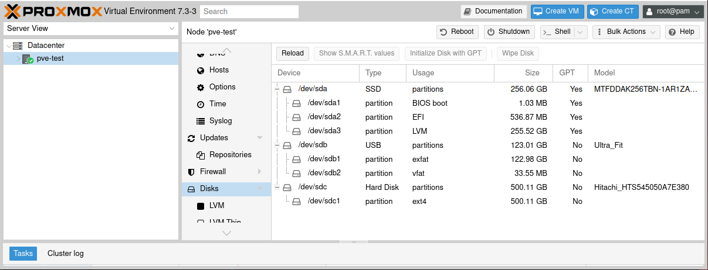

# Ajouter un disque dans Proxmox.


Nous allons voir comment ajouter un disque dur dans Proxmox autre que celui ou proxmox est installé.

Commencer par brancher votre disque sur votre proxmox.

* Verifier que celui ci apparait bien dans votre noeud (ici `pve_test`) puis `Disk`


Vous remarquez que j'ai trois disques :
**sda** qui est mon disque systeme (celui ou est installé Proxmox),
**sdb** qui est la clé USB Ventoy qui m'a servit a installer proxmox sur cette machine,
**sdc** qui est un disque mecanique de 500go (brancher lui aussi en USB pour le test)

Nous allons donc ajouter le disque **sdc**.

* Lancer le shell,
* Créer le volume physique  avec la commande `pvcreate /dev/sdc` (sdc dans mon cas mais cela est a adapter chez vous),

* Créer un Volume Group via la commande `vgcreate nom_group_volume /dev/sdc` (a vous de donner un nom),
blablblablabla


### Disque non vide.
Alors ne faites pas cela avec un disque NTFS, je ne sais pas si ca march.

Je pars d'un disque au format EXT4 avec des données.


# Installationde OMV  sur Proxmox


Ajout de l'image ISO soit directement si vous l'avez desja dtelechargé soit via le lien 

installation Classique

Le mot e passe super utilisateur correspond au mot de pass de l'user root dans votre VM OMV


Choisir KVM64 comme processeur


### Installation du Qemu Agent

>Normalement c'est deja installé.

Connectez vous a votre OpenMediaVault soit via SSH soit via le terminal Proxmox.

Les identifiants sont root et le mot de passe administrateur saisie lors de l'installation.

`apt install qemu-guest-agent`

## Ajouter des disques.
Verifions quels sont les disques deja present dans votre VM OMV.
* Lancer le Shell de la VM de recevoir les disques (ici OpenMediaVault),
* Connectez vous (root et mot de passe défini a l'instllation de OMV),
* lancer la commande `fdisk -l` pour montrer les disques present.

Normalement a ce stade, seul le disque de 32Go (si parametre par defaut lors de la creation de la VM) est present

Ajoutons donc un disque.

### Ajouter un disque en Passthrough.**
Verifier que votre disque soit bien vu dans Proxmox.
* Rendez vous dans `votre noeud` puis dans Disque,
* Verifier la presence de vos disques.


### Si Dique tout neuf sans partition.
fdisk -l pour lister les disques

fdisk /dev/sdX


#### Recuperation de l'ID de votre disque.
Dans votre noeud, lancer le shell.
* Lancer la commande `lsblk -l -o NAME,PARTUUID /dev/sdb1` (sdb1 a remplacer par votre disque)

Resultat :
```bash
root@pve-test:~# lsblk -l -o NAME,PARTUUID /dev/sdb1
NAME PARTUUID
sdb1 d0f0dfca-01
```

#### Monter le disque.
Il vous sufit de lancer la commande suivante en remplacant <ID_VM> par l'ID de vla VM devant beneficier des disques, rem^mlacer scsi1 par l'emplacement de montage desiré et <PARTUUID> par le votre.
```
qm set <id-VM> -scsi1 /dev/disk/by-partuuid/<PARTUUID>
```


---

Commande maison
sda1 df50434a-49de-41bb-9a2b-630dd73c4680   qm set 104 -scsi21 /dev/disk/by-partuuid/df50434a-49de-41bb-9a2b-630dd73c4680
sdb1 e44b1276-0794-8d47-b1a6-5fcb5024313c   qm set 104 -scsi23 /dev/disk/by-partuuid/e44b1276-0794-8d47-b1a6-5fcb5024313c
sdd1 49effdb4-01   qm set 104 -scsi24 /dev/disk/by-partuuid/49effdb4-01

---


Résultat :
```
root@pve-test:~# qm set 100 -scsi10 /dev/disk/by-partuuid/d0f0dfca-01
update VM 100: -scsi10 /dev/disk/by-partuuid/d0f0dfca-01
```

Verifier la presence d'un autre disque en ouvrant la console de votre VM et en lancant la commande `fdisk -l`. Un nouveau disque est apparue et il peut donc etre utilisé dans OMV.


Pour supprimer un passthrough
```
qm set 100 -delete scsiXX
```

Resultat :
```bash
root@pve-test:~# qm set 100 -delete scsi10
update VM 100: -delete scsi10
```


### Particularité des disques RAID
```
mdadm --create /dev/md0 -l1 -n2 /dev/sdb /dev/sdc
```

### Desactiver l'IP V6
https://3os.org/infrastructure/proxmox/network/disable-ipv6/

#### SOurces :
Pour le Passthrough : https://www.forum-nas.fr/threads/m%C3%A9mo-montage-dune-partition-dun-hdd-ssd-en-passthrough-dans-un-vm-proxmox.17585/

Calcul des masques IP https://cric.grenoble.cnrs.fr/Administrateurs/Outils/CalculMasque/


Sauvegarde : https://forum.openmediavault.org/index.php?thread/47589-how-to-backup-and-restore-omv-configuration-with-omv-regen/