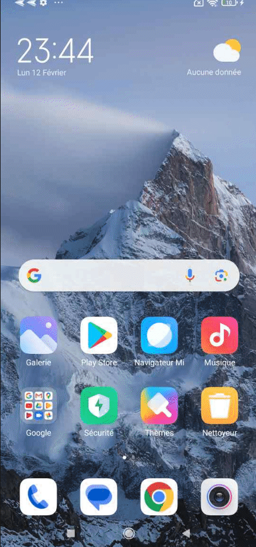

**Tuto réalisé avec :**

* Xiaomi Redmi Note 8 Pro (Begonia) version `Global` v12.0.4.0 QGGEUXM (Android 10)
* BRP3.5.2v3.1
* crDroid ???

J'ai récupéré un Xiaomi Redmi Note 8 Pro pour que je puisse le vider avant de le filer à quelqu'un, j'en ai profité pour le mettre à jour avec une Rom Custom (personnalisée) qui permettra de supprimer toutes les pubs intrusives de Xiaomi et de le déconnecter de leur cloud.

Ce smartphone m'a donné du fil à retordre à cause de TWRP qui n'est pas à jour pour ce smartphone et qui rend la méthode d'installation classique, via TWRP, impossible. Heureusement, la [communauté XDA](https://xdaforums.com/) est toujours là.

Passons à la pratique ! ;)

Pour commencer, il va falloir mettre à jour votre smartphone vers la dernière version officiellement disponible.

## Mettre à jour son Xiaomi Redmi Note 8 Pro (begonia)

Mettez à jour votre Redmi Note 8 Pro vers la version v12.5 minimum (Android 11) (la dernière version officielle de Xiaomi est la 12.5.15.0.RGGEUXM, mais je n'ai pas réussi à passer au-dessus de la v12.5.14.0)

Pour ma part, je suis parti de la v12.0.4.0 QGGEUXM (Android 10), 

**\*Note :** C'est la Rom Europe dite "Global", mais qui est remplacée par la EEA depuis la version 12.0.6.0 aussi à destination de l'Europe.*

Alors deux choix s'offrent à vous :

1. Jouer sur les régions pour récupérer de manière officielle les dernières Roms (recommandé)
2. Récupérer les Roms sur les liens ci-dessous, puis les installer depuis votre smartphone (elles seront vérifiées avant d'être installées).
3. Récupérer les Roms sur les liens ci-dessous, puis les installer via ADB.

### Depuis le téléphone

Pour mettre à jour directement depuis Xiaomi, il va falloir jouer avec les régions (Guyane française, Serbie, Grèce, il faut essayer et redémarrer le smartphone à chaque fois). Pour cela :

* Rendez-vous dans `Paramètres -> Paramètres supplémentaires -> Région`,


**\*Note :** Je me suis arrêté à la version 12.5.14, car je n'arrivais pas à voir la dernière 12.5.15. **Le principal, c'est d'être sur une version 12.5**.*

### Depuis les liens

Il va falloir récupérer la 12.0.6.0.QGGEUXM via ce [lien](https://xiaomifirmwareupdater.com/miui/begonia/stable%20beta/V12.0.6.0.QGGEUXM/) puis la coller dans votre téléphone.

Faites de même avec la dernière version 12.5.15.0.RGGEUXM (2.4Go) récupérable [ici](https://xiaomifirmwareupdater.com/miui/begonia/stable/V12.5.15.0.RGGEUXM/).

**\*Note :** Cette méthode n'a pas marché chez moi, les Roms ne passaient pas le check, je me suis donc arrêté à la version 12.5.14. Mais je n'avais pas de carte SIM dans le téléphone, peut-être est-ce lié à ça. **Le principal, c'est d'être sur une version 12.5**.*

Ensuite, allez dans `Paramètres -> A propos du téléphone` puis cliquez sur `Version MIUI` (carré image en haut à gauche).
Une fois affiché, **appuyez sept fois** sur le logo. Un popup doit vous afficher : *des fonctionnalités de mise à jour supplémentaires sont disponibles*.


Cliquez maintenant sur les trois petits points en haut à droite puis `Sélectionner une mise à jour à installer` sélectionner le fichier téléchargé précédemment (d'abord le v12.0.6.0) puis, après une vérification, il va l'installer et redémarrer.


### Installer TWRP

1. Activez les options développeur.

   
2. Rendez-vous dans les options développeur `Paramètres -> Paramètres supplémentaires -> Options développeur`.
3. Vérifiez que le `déverrouillage OEM` est désactivé (doit être grisé)
4. Vérifiez que le `statut du déverrouillage` Mi est bien `Déverrouillé`
5. Activez le `débogage USB`

   
6. Branchez votre smartphone à votre PC et validez le popup d'autorisation du débogage USB.
7. Récupérez le fichier `fastboot-zip/MIUI12.5/BRP3.5.2v3.1-fastboot.zip` à [cette adresse](https://sourceforge.net/projects/begonianon-cfw/) et dézippez-le pour récupérer le fichier `BRP3.5.2v3.1.img`
8. Assurez-vous d'**avoir le fichier ZIP de la version de MUI installée sur votre smartphone** (miui_BEGONIAEEAGlobal_V12.5.14.0.RGGEUXM_d0012c6e24_11.0.zip) qu'il faut dézipper pour récupérer le fichier `vbmeta.img`

Maintenant, pour lancer les commandes suivantes, il vous faut ADB et Fastboot sur votre machine.

#### Pour Linux

Installer ADB ET FASTBOO ?????????????

??????????????????????????????????????

Et vérifiez la version d'ADB et de Fastboot installée avec `adb version` et `fastboot --version`.

```bash
anthony@McFly-Bureau:~/platform-tools$ adb version
Android Debug Bridge version 1.0.41
Version 34.0.0-9570255
Installed as /usr/lib/android-sdk/platform-tools/adb

anthony@McFly-Bureau:~/platform-tools$ fastboot --version
fastboot version 34.0.5-10900879
Installed as /usr/lib/android-sdk/platform-tools/fastboot
```


Dans le dossier `platform-tools`, copiez le fichier `vbmeta.img` (remplacez celui existant) et le fichier `BRP3.5.2v3.1.img` de votre version de MIUI et lancez les commandes suivantes dans un Terminal depuis le dossier `platform-tools`.

```bash
adb reboot bootloader
fastboot devices

fastboot flash recovery BRP3.5.2v3.1.img
fastboot flash vbmeta miui_BEGONIAEEAGlobal_V12.5.14.0.RGGEUXM_d0012c6e24_11.0/vbmeta.img --disable-verity --disable-verification
fastboot reboot recovery
```

***Retour des commandes :***

```shell
anthony@McFly-Bureau:~/platform-tools$ adb reboot bootloader
anthony@McFly-Bureau:~/platform-tools$ fastboot devices
8xnbw8giv4fuucfq	 fastboot
anthony@McFly-Bureau:~/platform-tools$ fastboot flash recovery BRP3.5.2v3.1.img 
Sending 'recovery' (65536 KB)                      OKAY [  2.119s]
Writing 'recovery'                                 OKAY [  0.305s]
Finished. Total time: 2.428s
anthony@McFly-Bureau:~/platform-tools$ fastboot flash vbmeta vbmeta.img --disable-verity --disable-verification
Rewriting vbmeta struct at offset: 0
Sending 'vbmeta' (4 KB)                            OKAY [  0.012s]
Writing 'vbmeta'                                   OKAY [  0.001s]
Finished. Total time: 0.016s
anthony@McFly-Bureau:~/platform-tools$ fastboot reboot recovery
Rebooting into recovery                            OKAY [  0.001s]
Finished. Total time: 0.251s
```

Votre smartphone redémarre sur un TWRP modifié

Passons à l'installation d'une Rom personnalisée

## Via le recovery (TWRP)

**\*ATTENTION :** Cette méthode peut ne pas fonctionner si votre TWRP n'est pas compatible avec la version Android de votre ROM, dans ce cas, privilégiez la méthode ADB ou alors flasher le recovery qui peut être fourni avec la rom que vous souhaitez installer en suivant la méthode ci-dessous en remplaçant le `roms.zip` par votre fichier `recovery.zip`.*

Exemple avec crDroid qui apporte la version Android 14 à votre Xiaomi Redmi Note 8 Pro, il lui faudra donc un recovery compatible Android 14 qui est récupérable via le site de crDroid.

1. Démarrage sous recovery (Soit via le menu avancé ou en appuyant sur le bouton ON/OFF + Volume Haut au démarrage du smartphone),
2. Lors du lacement de TWRP, vous pouvez le passer en Français en cliquant sur `Select language`,
3. Ensuite, faites glisser la barre en bas vers la droite pour `autoriser les modifications`,
4. Sélectionnez `Formater (Wipe)-> Formater les données (format data)` puis validez avec `yes`,

   **\*ATTENTION :** Toutes vos données seront supprimées et c'est **irréversible**.*
5. Ensuite, faites `Retour (Return)` puis cliquez deux fois sur la flèche `<` pour revenir au menu principal,
6. Allez dans `Montage partitions (Mount)` puis sélectionnez `Systéme (System)` et `Données (data)`,
   Cliquez sur `Sélect. l'emplacement (Select Storage)` puis sur `mémoire interne (Internal Storage)` et sur `OK`, vous devriez avoir votre smartphone reconnu sous Linux (ou Windaub).
7. Coller la rom custom de votre choix dans le dossier TWRP par exemple ou à la racine si vous préférez.

Une fois le rom collé, retourner sur la page principale du menu puis :

1. Sélectionnez `Installer (install)`,
2. Sélectionnez votre `roms.zip` laisser les deux cases décochées,
3. Faites glisser pour confirmer le flash en bas de l'écran,

Une fois le flash terminé, revenez au menu principal.

1. Cliquez sur `Formatter -> Formatter les données`  puis tapez sur `yes`,
2. Cliquez sur `Redémarrer le systeme (reboot systeme)`.

Normalement, votre téléphone devrait démarrer sur la Roms crDroid fraichement installée.

## Via ADB

1. Entrez dans le recovery avec Bouton On/Off et volume haut,
2. Allez dans `Paramètres avancé (advanced)` puis `Transfert via ADB (sideload)`,
3. Cochez `Effacer le cache Dalvik (Wipe Davlvik Cache)` et `Effacer le Cache  (Wipe Cache)` 
4. Faites glisser la barre du bas pour valider.
5. Depuis votre PC, dans un Terminal, lancer la commande suivante (adapter avec le nom de votre Roms)
   `adb sideload filename.zip`

Retour avec crDroid :

```bash
anthony@Bureau:~/platform-tools$ adb sideload roms/crDroidAndroid-14.0-20240112-begonia-v10.1.zip 
serving: 'roms/crDroidAndroid-14.0-20240112-begonia-v10.1.zip'  (~15%)    
```

Une fois le flash terminé, redémarrez le smartphone.

S'il redémarre sur TWRP,

## Installer Android 14

Nous allons installé crDroid pour Xiaomi Redmi Note 8 Pro avec Android 14.

Il faut d'abord installer le recvery compatible ici en suivant la meme procedure qu'au dessus mais au lieu de flasher le fichier BPR????.img vous allez flasher le fichier recovery .img qui se trouve dans le dosier fraichement telechargé depuis le lien de crDroid
Ensuite pssons a l'installtion de la roms rn suivant le procedure via TWRP ou via ADB. en faisant un format data puis en rebootant le syseme a la fin.

## Revenir sur la rom MIUI

Pour revenir a la rom d'origine, il vous suffit soit de passer la TWRP et copier coller la derniere version de la roms Xiaomi pour votre smartphone ou alors via aADB.

### Sources

* https://xdaforums.com/t/recovery-unofficial-begonia-recovery-project-themed-twrp-3-5-0-v2-unified-begonia-begoniain.4242717/
* https://www.phonandroid.com/forum/threads/probleme-mise-a-jour-miui-sur-redmi-note-8-pro.214881/
* https://android-mt.ouest-france.fr/tutoriel/astuces/liste-des-commandes-adb-et-fastboot-loutil-indispensable-du-super-utilisateur-android/74897/
