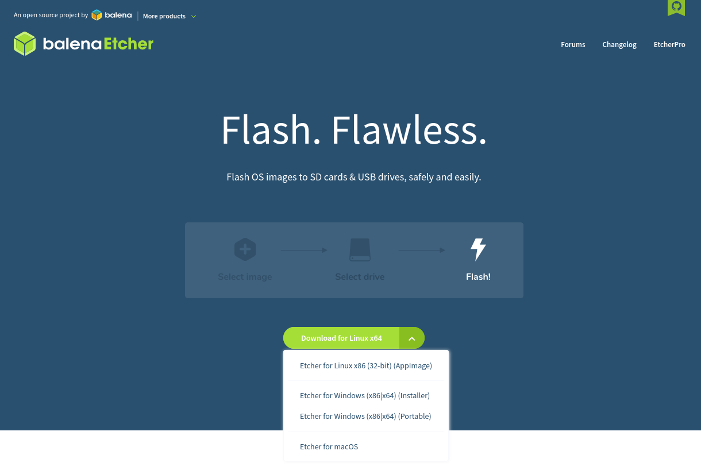
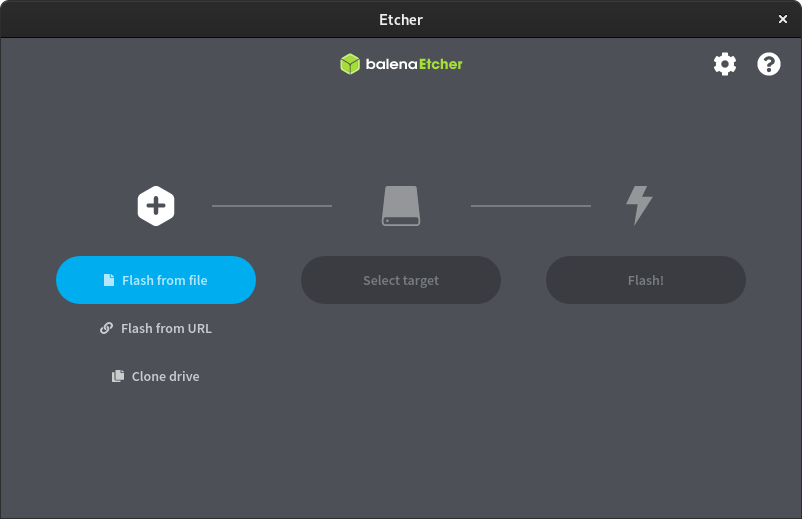
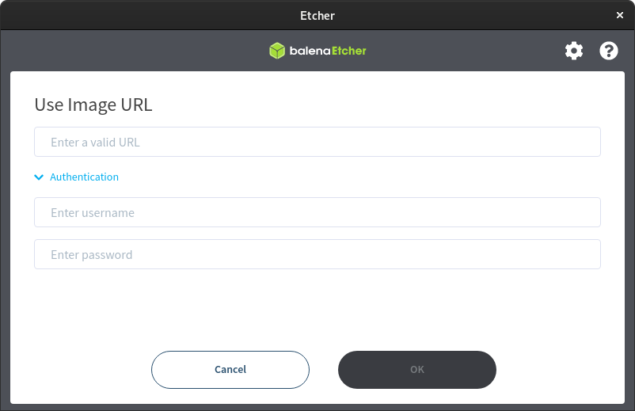
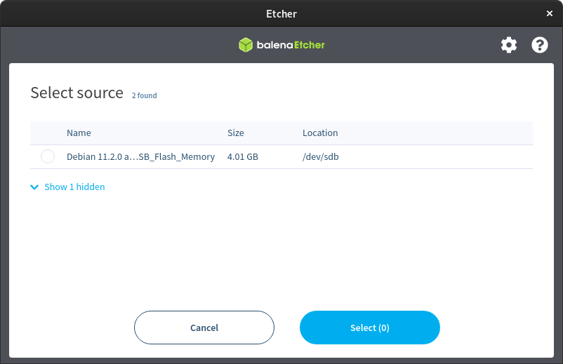
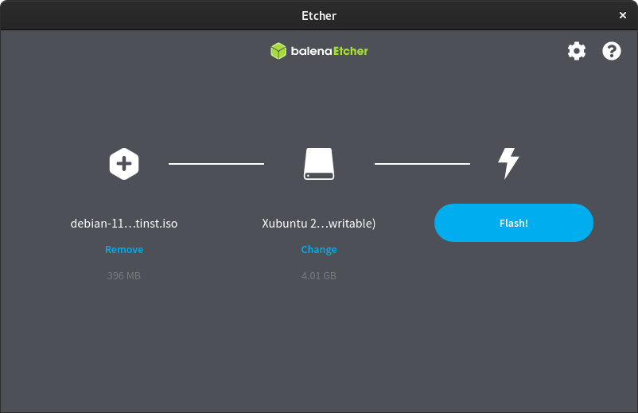
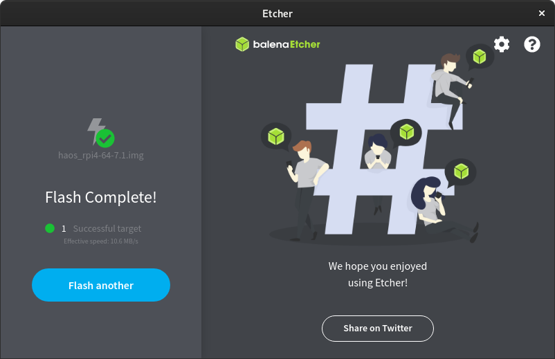

Nous allons voir rapidement comment utiliser [Balena Etcher](https://etcher.balena.io/) pour copier vos systèmes d'exploitation (OS) sur un support amovible en vue de les installer sur une machine ou tout simplement de démarrer dessus.

C'est un logiciel très simple d'utilisation avec deux possibilités :
* À partir d'un OS téléchargé en avance,
* À partir d'une URL.

## Utilisation

Il vous suffit de récupérer la version correspondante à votre OS sur le [site de Balena Etcher](https://etcher.balena.io/#download-etcher), Pour Windows et Linux, l'application existe en version portable ou AppImage (pas besoin de l'installer, ça suffit largement).

Une fois récupéré et exécuté, il ne vous reste plus que trois étapes :
* Sélectionner l'image (OS) téléchargé OU via une URL,
* Sélectionner le support,
* Cliquer sur FLASH.

****L'OS téléchargé peut être dans un format compressé (ZIP, 7ZIP, RAR), Balena le décompressera tout seul****

Voici une série d'images.

Vous avez vu, c'était rapide ;)

Je n'utilise plus trop Balena Etcher, car quand je prépare des cartes pour les Raspberry Pi, je passe maintenant par [Raspberry Pi Imager](/blog/raspberry_pi_installer_os) ou alors via ma clé [USB Ventoy](/blog/ventoy_installation_update) pour tout ce qui est ordinateur ou serveur, mais l'article était déjà écrit, alors autant le mettre à disposition.
