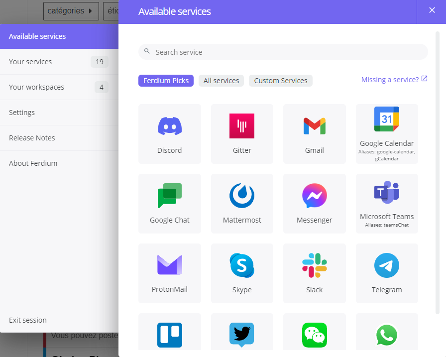
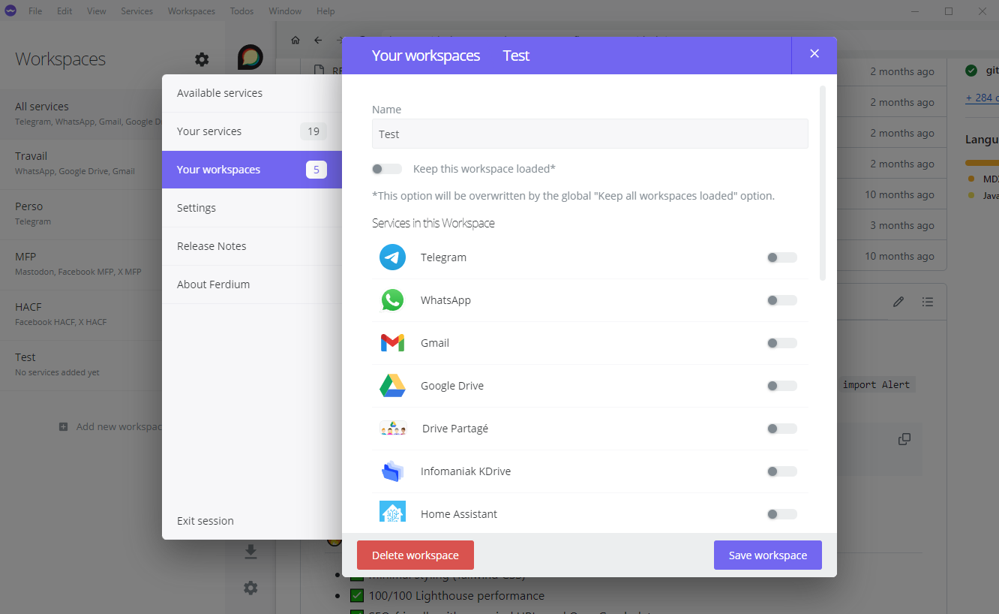
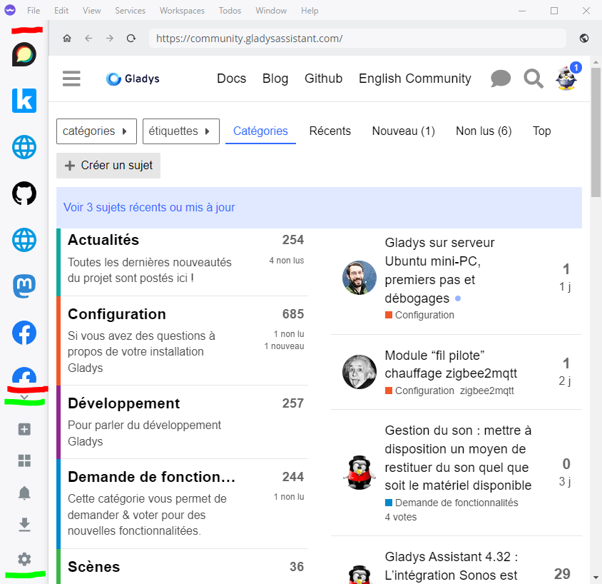
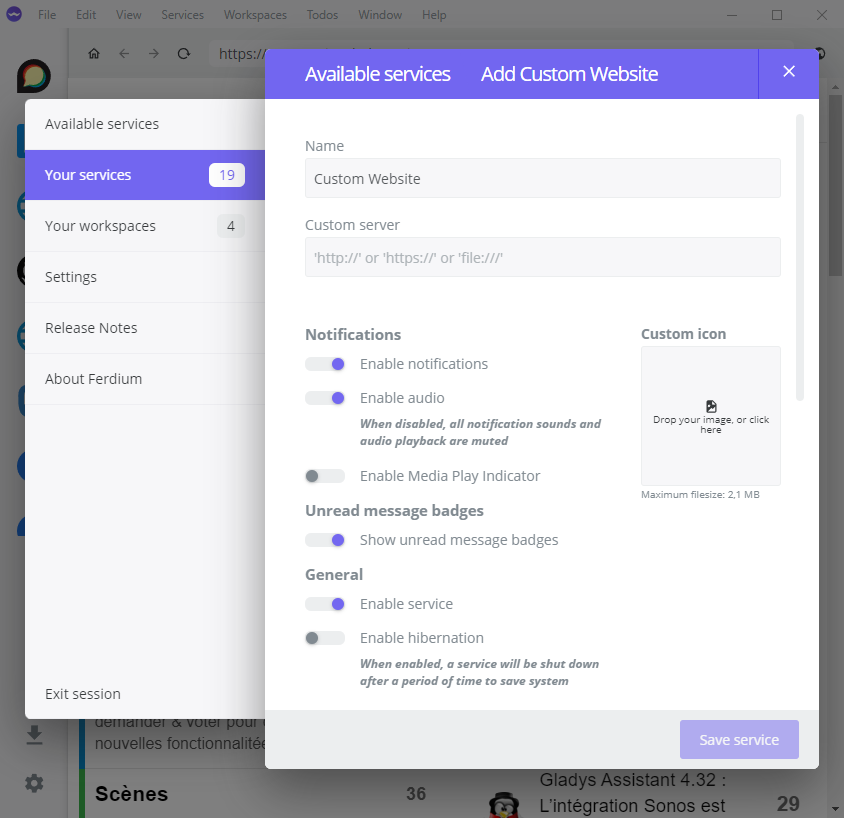
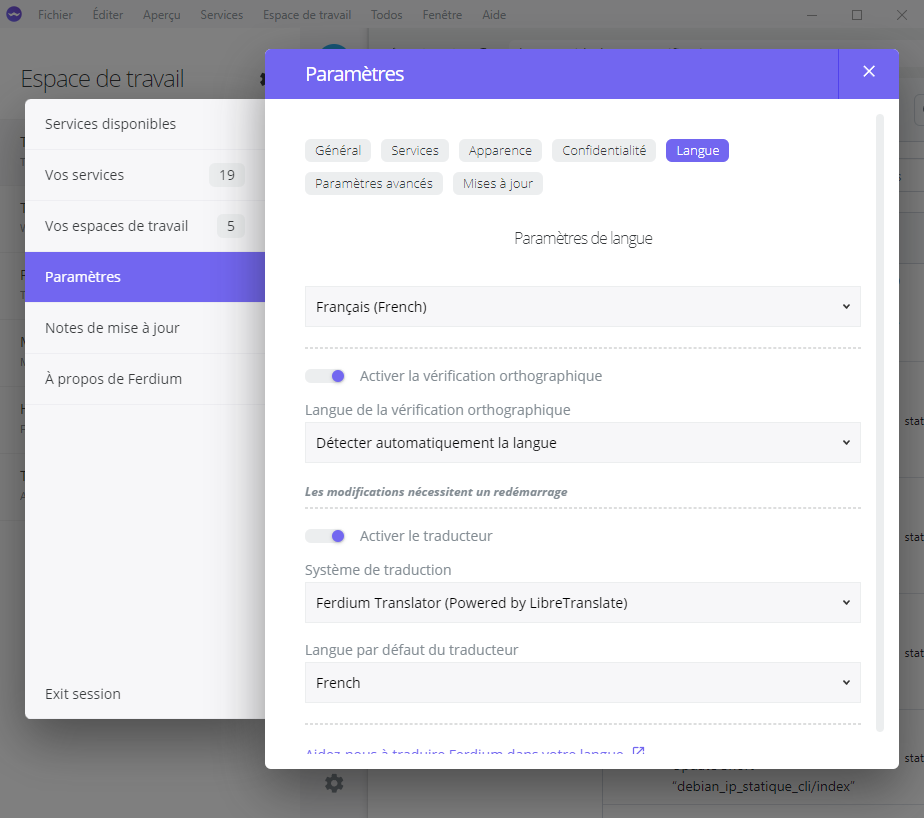

import Alert from "@components/mdx/Alert.astro";

Dans un monde numérique en constante évolution, la gestion de multiples applications de messagerie et de productivité est devenue un défi quotidien pour de nombreux professionnels et particuliers. C'est là qu'intervient [Ferdium](https://ferdium.org/), une application révolutionnaire qui promet de simplifier votre vie numérique en centralisant toutes vos applications préférées en un seul endroit. 

De plus, grâce à son système "d'onglet" par application, elle empêche le partage d'information entre les services, ce qui évite de faire grandir votre empreinte numérique de Méta, Google et consœur.

Un autre avantage est aussi la possibilité de regrouper certaines applications dans des "**Espaces de travail**" (Personnel, Professionnel par exemple) qu'il est possible de rendre silencieux, mais aussi de multiplier les comptes d'un même service.

Plongeons dans l'univers de [Ferdium](https://ferdium.org/) et découvrons comment cet outil peut transformer votre façon de travailler et de communiquer.

## Qu'est-ce que Ferdium ?

[Ferdium](https://ferdium.org/) est une application de bureau gratuite et open-source qui agit comme un hub central pour vos services de messagerie, de réseaux sociaux et d'autres services de productivités (Nextcloud, Kdrive, Home Assistant, etc, etc). Inspiré par [Franz](https://meetfranz.com/), un autre agrégateur de services populaire, [Ferdium](https://ferdium.org/) va plus loin en offrant des fonctionnalités avancées et une plus grande personnalisation.

L'objectif principal de Ferdium est de vous permettre d'accéder à tous vos comptes et services depuis une seule interface, éliminant ainsi le besoin de jongler entre plusieurs applications ou onglets de navigateur. Que vous utilisiez WhatsApp, Slack, Gmail, Trello ou Discord, Ferdium les rassemble tous sous un même toit, dans des vues séparées et non communicantes ensemble.

## Caractéristiques principales

### Prise en charge d'un large éventail de services

Ferdium supporte plus de 100 services différents, couvrant pratiquement tous les besoins en matière de communication et de productivité. Parmi les services populaires, on trouve :

* **Messagerie** : WhatsApp, Telegram, Signal, Facebook Messenger
* **E-mail :** Gmail, Outlook, ProtonMail
* **Réseaux sociaux :** Twitter, LinkedIn, Instagram
* **Productivité :** Trello, Asana, Todoist
* **Communication d'équipe :** Slack, Microsoft Teams, Discord

### Des espaces de travail

Il est possible de regrouper ses services/applications par groupe et d'activer ou pas les notifications de ceux-ci en fonction de nos besoins.

Quand vous êtes au travail et que vous ne souhaitez pas être dérangé par les notifications de vos réseaux privés, il vous suffit de n'activer que votre espace de travail professionnel.

### Interface utilisateur intuitive

L'interface de Ferdium est conçue pour être simple et efficace. Une barre latérale (entre traits rouges) liste tous vos services ajoutés, vous permettant de basculer rapidement entre eux d'un simple clic. Chaque service s'ouvre dans son propre onglet, offrant une expérience similaire à celle d'un navigateur web.

La partie entre les traits verts permet de :

* Ajouter une application ou service,
* Sélectionner un espace de travail,
* Activer ou désactiver les notifications,
* Gérer ses téléchargements,
* Configurer Ferdium.

### Personnalisation poussée

Ferdium offre un haut degré de personnalisation. Vous pouvez :

* Organiser vos services en groupes,
* Personnaliser les icônes et les couleurs des services,
* Définir des raccourcis clavier personnalisés,
* Choisir entre différents thèmes d'interface (clair, sombre, système),
* Possibilité d'ajouter un service qui n'est pas encore officiellement supporté via les `Custom Website`,

  

#### Notifications centralisées

L'une des fonctionnalités les plus appréciées de Ferdium est sa gestion centralisée des notifications. Vous pouvez recevoir des alertes pour tous vos services en un seul endroit, avec la possibilité de personnaliser les paramètres de notification pour chaque service individuellement.

#### Mode "Ne pas déranger" avancé

Ferdium propose un mode "Ne pas déranger" sophistiqué qui vous permet de bloquer les notifications pendant des périodes spécifiques ou lorsque vous travaillez sur certaines tâches. Vous pouvez même programmer des plages horaires récurrentes durant lesquelles les notifications seront automatiquement désactivées.

### Sécurité et confidentialité

En tant qu'application open-source, Ferdium est transparent sur la manière dont il gère vos données. L'application propose deux façons de se connecter. Soit :

* **Via leur Cloud :** Vous permet de retrouver votre configuration depuis n'importe qu'elle machine où vous installez Ferdium par simple connexion. Nécessite la création d'un compte. Ferdium utilise le chiffrement pour protéger vos données.
* **En local :** Vous permet d'utiliser Ferdium sans compte, garantissant ainsi un niveau de confidentialité encore plus élevé. C'est à vous d'exporter et d'importer votre configuration entre les différents périphériques.

### Des réglages supplémentaires

Dans Ferdium, il y a des petits trucs en plus non négligeables, accessible directement dans les paramètres de l'application. Voici quelques-unes d'entre elle :

* Changement de la langue d'interface,
* Ajout d'un traducteur se basant sur Google (Beurk) ou [LibreTranslate](https://libretranslate.com/),
* Exporter ou importer votre configuration ou vider le cache depuis les paramètres avancés
* Etc, etc...

  

## Avantages et inconvénients

### Avantages

* **Gain de temps et productivité accrue**

En centralisant tous vos services, Ferdium vous fait gagner un temps précieux que vous auriez autrement passé à basculer entre différentes applications. Cette organisation optimisée se traduit par une augmentation significative de la productivité.

* **Réduction de la consommation de ressources**

Au lieu d'exécuter plusieurs applications gourmandes en ressources, Ferdium permet d'économiser la mémoire et la puissance de traitement de votre ordinateur. Cela est particulièrement bénéfique pour les ordinateurs moins puissants ou plus anciens.

* **Personnalisation et contrôle**

Ferdium vous donne un contrôle total sur votre environnement de travail numérique. Vous pouvez organiser vos services comme bon vous semble et ajuster les paramètres de notification pour trouver l'équilibre parfait entre rester informé et éviter les distractions.

* **Multiplateforme**

Disponible pour Windows, macOS et Linux, Ferdium vous offre une expérience cohérente quel que soit le système d'exploitation que vous utilisez.

<Alert type="info">Ferdium n'est actuellement pas présent sur Mobile et ne le sera pas (si l'on en croit [cette discussion](https://github.com/orgs/ferdium/discussions/1696), c'est bien dommage, mais à voir dans le temps</Alert>

### Inconvénients

Malgré ses nombreux avantages, Ferdium n'est pas sans défauts :

* Des problèmes occasionnels de synchronisation avec certains services nécessitent une relance du service,
* L'application peut consommer beaucoup de mémoire si de nombreux services sont ouverts simultanément,
* Certaines fonctionnalités de services peuvent ne pas être disponibles dans l'interface Ferdium (Sondages WhatsApp par exemple).
* Pas de version mobile (voir plus haut)

## Comparaison avec d'autres solutions

Ferdium n'est pas le seul agrégateur de services sur le marché, il se distingue par plusieurs aspects :

* Contrairement à [Franz](https://meetfranz.com/), Ferdium est entièrement gratuit et open-source, sans limites sur le nombre de services que vous pouvez ajouter.
* Par rapport à [Rambox](https://rambox.app/), Ferdium offre une interface plus légère et une meilleure performance sur les systèmes moins puissants.
* Comparé à des solutions comme [Station](https://getstation.com/), Ferdium se concentre davantage sur la personnalisation et le contrôle utilisateur.

## Conclusion

En tant que projet open-source, Ferdium bénéficie d'une communauté active de développeurs qui travaillent constamment à l'amélioration de l'application. Les mises à jour régulières apportent de nouvelles fonctionnalités, un support pour plus de services et des améliorations de performance.

Ferdium représente une avancée significative dans la manière dont nous interagissons avec nos multiples services numériques. En offrant une solution centralisée, personnalisable et efficace, il répond à un besoin croissant de simplification dans notre vie numérique de plus en plus complexe.

Que vous soyez un professionnel jonglant avec de multiples canaux de communication, un étudiant cherchant à organiser vos outils d'apprentissage, ou simplement quelqu'un qui souhaite rationaliser sa vie numérique, Ferdium mérite certainement votre attention.

En adoptant Ferdium, vous faites un pas vers une vie numérique plus organisée, plus productive et, finalement, plus sereine en **évitant le pillage de votre vie numérique**.

## Sources

* Le [site officiel](https://ferdium.org/)
* [Télécharger Ferdium](https://ferdium.org/download)
* Le [Github](https://github.com/ferdium/ferdium-app)
* La [discussion sur l'app mobile](https://github.com/orgs/ferdium/discussions/1696)
* Le salon [Discord](https://discord.gg/jVv4Qns8pP)
* La [page Reddit](https://www.reddit.com/r/ferdium/)
