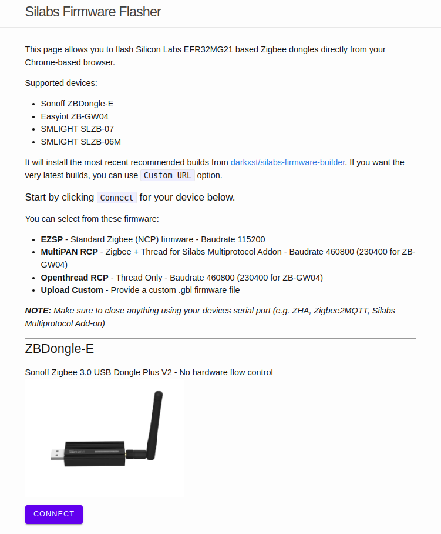
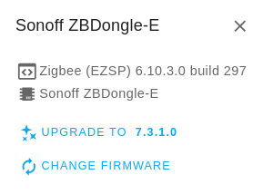
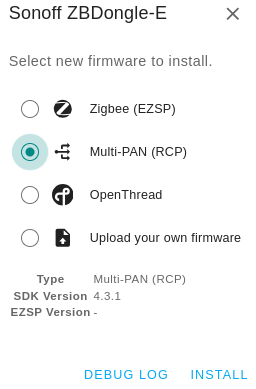
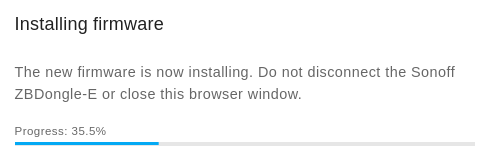
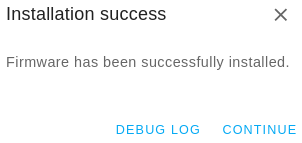
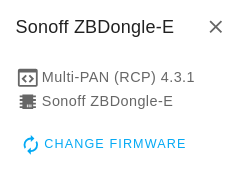

import Alert from "@components/mdx/Alert.astro";

La clé USB Sonoff ZBDongle E est basé sur une puce EFR32MG21 qui permet le support de Thread et du Zigbee.

Je ne vais pas vous cacher que je suis encore sceptique sur le protocole Thread. Cela fait quelques années que l'on nous en parle et on commence seulement à voir du matériel compatible.

Tout comme le Zigbee qui était aussi censé rendre tous les appareils interopérables, les constructeurs ont vite ajouté des surcouches ou ils se sont autorisé des fantaisies dans le codage pour le rendre inopérable avec les concurrents. Bien sûr, ce n'est qu'une histoire de gros sous.

Si le "protocole" Thread arrive avec ce qu'il promet, ce sera une très grosse avancée pour la domotique.

**Qu'est-ce que Thread** (très rapidement) **:**

Thread est un protocole réseau maillé conçu pour la domotique. Il permet aux appareils de communiquer entre eux de manière sécurisée et efficace, sans avoir à passer par un routeur Wi-Fi ou un hub central.

*Je ferais peut-être un article dessus, mais plus tard, car comme je vous l'ai dit. Je suis sceptique.*

Revenons à nos moutons !!!

<Alert type="warning">Si votre coordinateur actuel est le ZBDongle E, il vous faudra tout réapairer après le flash du firmware. Le **flash peut comporter des risques**, à vous de les assumer.</Alert>

Je vais vous montrer les deux méthodes permettant de flasher la clé Sonoff 

* Directement avec un module complémentaire dans Home Assistant, 
* Directement depuis un navigateur compatible WebSerial API comme Chrome/Chromium ou Edge.

Les deux sont relativement simples.

**Matériels utilisé :**

* Sonoff ZBDongle E [Domadoo](https://www.domadoo.fr/fr/interface-domotique/6315-sonoff-zbdongle-e-cle-usb-dongle-zigbee-30-antenne-externe-20dbm-v2.html?domid=66), [Amazon](https://amzn.to/3UpzWPX), [AliExpress](https://s.click.aliexpress.com/e/_DmnOkph)
* Chromium v124.0.6367.207,
* Add-on Zigstar 0.1.1,
* HA 2024.5.4 / 12.3

## Flash du Firmware Multi protocole.

### Depuis le navigateur

1. Brancher le dongle Sonoff sur votre PC,
2. Rendez-vous a [cette adresse](https://darkxst.github.io/silabs-firmware-builder/) depuis un navigateur compatible WebSerial API,

   

   Si votre navigateur n'est pas compatible, vous devez avoir ce message.

   
3. Cliquez sur le bouton "CONNECT" sous la clé Sonoff puis sélectionnez votre clé.

   <Alert type="info">Si vous avez un navigateur compatible, mais que vous ne voyez pas votre ZBDongle, essayez cela.

* Sous Windows ou Mac vérifiez que vous avez bien le [driver CP2102](https://www.silabs.com/developers/usb-to-uart-bridge-vcp-drivers?tab=downloads) d'installé.
* Sous Ubuntu vérifier les autorisations de Chromium depuis l'Ubuntu Store (recherchez Chromium puis cliquez sur Permissions) car "Access USB hardware directly" n'est pas activé par défaut.

</Alert>

Une fois connecté, vous devez avoir toutes les informations de votre clé

4. Cliquez sur `CHANGE FIRMWARE`,
5. Sélectionnez Muti-PAN (RCP) dans la fenêtre qui s'affiche et cliquez sur `INSTALL`,

6. Cliquez sur CONTINUE et vous devriez avoir votre nouveau firmware d'affiché.

   
7. Au moment où j'écris, le firmware installé par le navigateur web est le 4.3.1, mais vous pouvez mettre le dernier qui est le 4.4.2 et qui se trouve [ici](https://github.com/darkxst/silabs-firmware-builder/tree/main/firmware_builds/zbdonglee) (Prendre le`rcp-uart-802154-v4.4.2-zbdonglee-460800.gbl` ou plus récent s'il y a.
8. Ensuite, suivez de nouveau le tuto à partir de l'étape 1 et choisissez `Upload your own firmware`, cliquez sur `UPLOAD` et sélectionnez le firmware que vous souhaitez installer.

### Depuis l'add-on Zigstart

Vous vous souvenez peut-être que j'ai fait un article sur le [flash de la clé Sonoff ZBDongle mais la version **P**](/blog/ha_flasher_sonoff_zigbee/) pour enlever la limite du nombre d'appareils imposé par Sonoff ? Eh bien **attention**, car nous n'allons pas utiliser le même add-on, mais par contre, c'est la même source à ajouter.

Voici les étapes :

1. Nous ajoutons une source externe, vous savez comment faire maintenant, sinon l'[article est ici](/blog/ha_addons/), ou plus simple en cliquant sur l'image ci-dessous ;
   [dfvsd](https://my.home-assistant.io/redirect/supervisor_add_addon_repository/?repository_url=https%3A%2F%2Fgithub.com%2Fmercenaruss%2Fzigstar_addons)

La version à installer est `ZigStar Silicon Labs FW Flasher` car la [Sonoff Zigbee 3.0 USB Dongle Plus **E**](https://amzn.to/3UpzWPX) est sous puce EFR32MG21

## Configuration sous Home Assistant

### Sources

* [Firmware Builder](https://darkxst.github.io/silabs-firmware-builder/)
* [Les firmwares](https://github.com/darkxst/silabs-firmware-builder/tree/main)
* [SmartHomeScene](https://smarthomescene.com/guides/how-to-enable-thread-and-matter-support-on-sonoff-zbdongle-e/)(pour la partie intégration HA)
