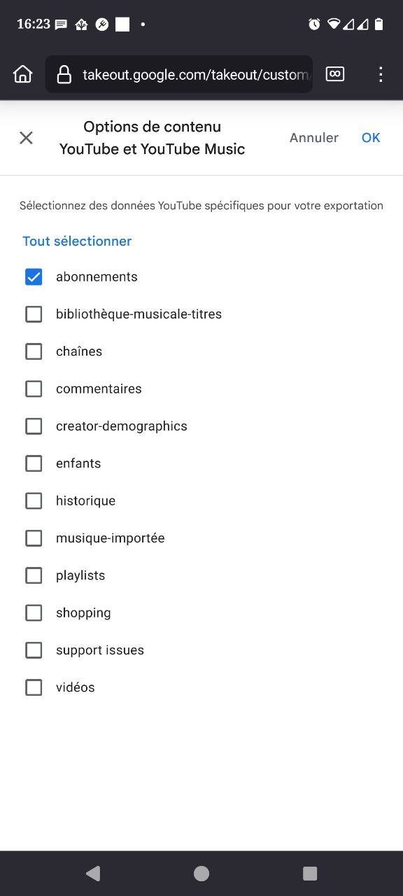

import Alert from "@components/mdx/Alert.astro";

Dans le paysage numérique actuel, YouTube représente une source incontournable de divertissement et d'information. Cependant, les publicités intrusives et les limitations de lecture peuvent rapidement devenir frustrantes. C'est précisément là que NewPipe entre en scène, comme une solution innovante et libératrice pour tous les utilisateurs en quête d'une expérience vidéo optimale.

Cette application open-source offre une alternative puissante à l'application YouTube officielle, proposant une expérience de visionnage totalement personnalisée et débarrassée des contraintes habituelles.

## NewPipe - Plus qu'une simple alternative YouTube

NewPipe n'est pas simplement un lecteur vidéo lambda. C'est un outil complet qui redéfinit l'interaction avec les plateformes de streaming. Développée par une communauté passionnée, cette application permet de contourner élégamment les restrictions traditionnelles.

Ses fonctionnalités principales incluent :

* Lecture en arrière-plan
* Téléchargement de vidéos
* Suppression des publicités
* Interface épurée et intuitive

### Des possibilités au-delà de YouTube

Bien que principalement connu pour YouTube, NewPipe supporte également d'autres plateformes comme :

* SoundCloud
* Bandcamp
* Media Ccc
* PeerTube

### Les fonctionnalités révolutionnaires

Les points forts de NewPipe sont nombreux et particulièrement séduisants. Premièrement, l'application supprime les publicités, vous permettant de profiter de vos contenus sans interruption. Ensuite, elle autorise la lecture en arrière-plan, un atout majeur pour les amateurs de podcasts ou de contenus musicaux. Enfin, elle propose un téléchargement direct des vidéos ou uniquement de l'audio, offrant ainsi une flexibilité incomparable.

## Installation de NewPipe - Un processus simple et rapide

### Téléchargement depuis le site officiel

Pour commencer votre aventure avec NewPipe, rendez-vous sur le [site officiel GitHub.](https://newpipe.net/#download) La page de téléchargement vous proposera le fichier `APK`correspondant à votre version d'Android. **Veillez à autoriser l'installation depuis des sources externes dans les paramètres de sécurité de votre appareil**.

Étapes d'Installation Détaillées

1. Téléchargez le fichier `APK`.
2. Ouvrez le fichier et confirmez l'installation.
3. Acceptez les autorisations requises.
4. Lancez l'application.

### Passer par F-Droid.

<Alert type="info">F-Droid est un magasin d'applications alternatif pour \*\*Android\*\* qui propose exclusivement des \*\*applications libres\*\* et \*\*open source\*\*.</Alert> 

Le catalogue de F-Droid est moins étendu que celui du Google Play Store, mais il se concentre sur la qualité et le respect de la vie privée des utilisateurs.

Passer par F-Droid vous permet d'être averti lors des mises à jour de NewPipe et de l'installer depuis F-Droid de façon encore plus simplifié.

## Importer vos abonnements YouTube - La facilité ultime

NewPipe a pensé à tout en proposant une fonctionnalité d'importation des abonnements YouTube. Cette synchronisation vous permettra de retrouver instantanément toutes vos chaînes favorites.

Processus d'Importation Étape par Étape :

1. Cliquez sur l'`icône TV`, puis sur les `trois petits points` en haut à droite.

   
2. Sélectionnez `Importer de` et choisir `Youtube`.

   
3. Suivre les étapes indiquées.

   

   * Cliquez sur le lien.
   * Connectez-vous à votre compte Google dans NewPipe.
   * Cliquez sur `Sélectionner les données à télécharger`, et sur `Tout désélectionner`, ensuite cochez `Youtube et YouTube Music` puis cliquez sur `Toutes les données Youtube` et sélectionnez uniquement `abonnements`, finir en validant sur `OK`.

     

     

* Cliquez sur `Continuer` puis `Créer une exportation`.
* Une fois l'exportation terminée, le fichier vous sera envoyé par mail.

Une fois le fichier reçu, on retourne sur l'import :

1. Cliquez sur l'`icône TV`, puis sur les `trois petits points` en haut à droite.2. 2. Sélectionnez `Importer de` et choisir `Youtube`.
2. En dessous de la procédure, cliquer sur `IMPORTER LE FICHIER`.
3. Sélectionnez le fichier et les chaînes désirées
4. Validez l'importation.

## Conclusion : Vers Une Nouvelle Expérience Numérique

NewPipe représente bien plus qu'une simple application. C'est une philosophie de liberté numérique, un outil qui replace l'utilisateur au centre de son expérience multimédia. En supprimant les contraintes publicitaires et en offrant une flexibilité totale, cette application transforme radicalement notre rapport au contenu vidéo.

J'utilise NewPipe depuis plusieurs années sans en trouver d'inconvénients. Sachez que le suivi des live est possible, mais vous n'aurez pas accès au chat.

De plus, vous pouvez exporter votre configuration et vos abonnements simplement pour les réimporter sur un autre appareil par exemple.

Derniers conseils supplémentaires

* Maintenez votre application à jour afin de contrer les mécanismes de Youtube.
* Consultez régulièrement la communauté pour des mises à jour.

### Sources.

* [Site officiel](https://newpipe.net/)
