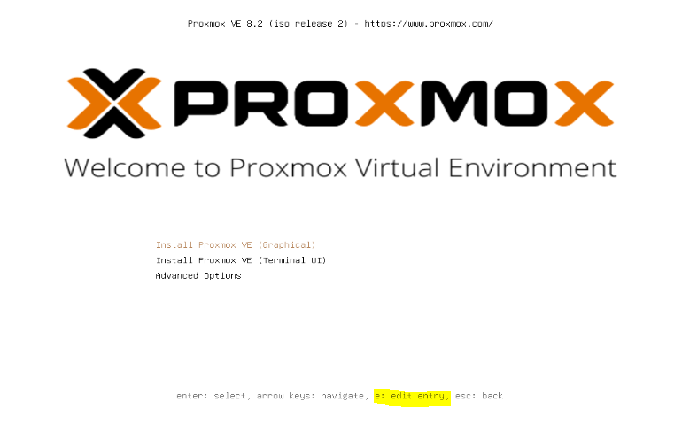
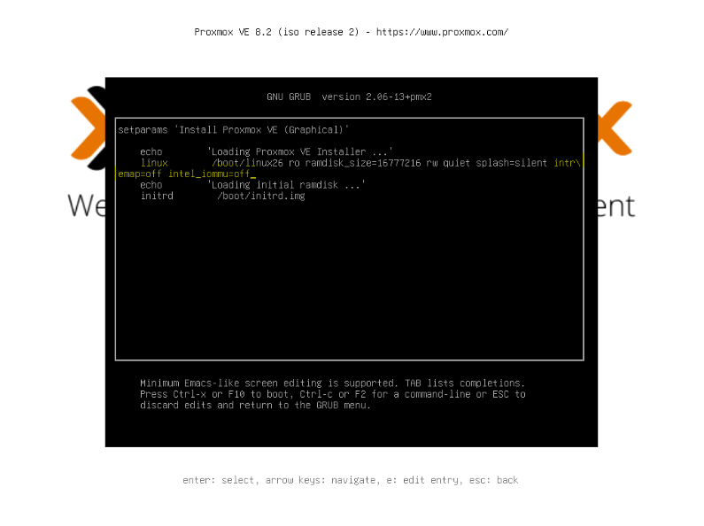

import Alert from "@components/mdx/Alert.astro";

Salut à tous.

Un article pour garder une trace de ce problème de lenteur lors de l'installation d'un OS récent sur un MicroServer HP Gen 8.

Lors de l'installation de Proxmox 8 sur le MicroServer HP Gen 8 via iLO, j'ai eu des gros problèmes de lenteur, rendant l'utilisation de l'interface iLO très compliquée, voire quasi inutilisable. Après avoir cherché sur le web, il semble que je ne sois pas le seul et que cela semble venir de la mise à jour du noyau Linux supérieur à 5.4.

Afin de garder une note et de vous partager la solution, nous allons voir comment y remédier en modifiant la commande du GRUB.

Au lancement de l'installation de Proxmox, lorsque vous arrivez sur la première page. Vous avez le choix entre les différents types d'installation. Mais si vous faites un peu plus attention, vous pouvez voir qu'il y a un autre menu accessible via les touches `e` pour `edit`.

Nous allons donc choisir cette option afin de modifier la ligne de commande de démarrage.

Dans le terminal qui s'affiche, nous allons ajouter deux choses `intremap=off` et `intel_iommu=off` puis soit <kbd>CTRL+x</kbd> ou <kbd>F10</kbd> pour valider et lancer l'installation.

<Alert type="info">L'antislash \ est mis automatiquement pour signaler que la ligne continue.</Alert>

<Alert type="warning">ATTENTION, les touches sont en QWERTY donc le <kbd>a</kbd>=<kbd>q</kbd>, <kbd>m</kbd>=<kbd>;</kbd>, <kbd>_</kbd>=<kbd>MAJ</kbd>+<kbd>)</kbd></span</Alert>

Ensuite, il ne vous reste à poursuivre [l'installation de Proxmox](/blog/proxmox_installation/).

## Conclusion.

Je tenais à partager cette information, car c'est un peu déroutant au début. Vous allez retrouver une utilisation optimale de votre interface iLO.

### Sources.

\* https://forum.proxmox.com/threads/updated-to-ve-7-0-no-web-gui-dmar-errors-on-console.92022/post-413545
