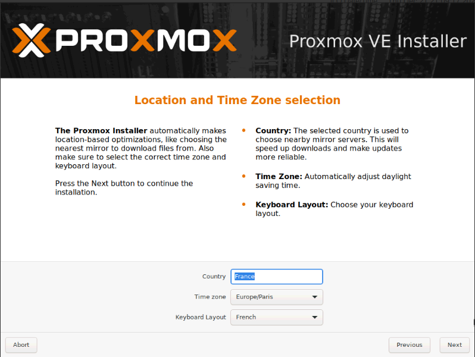
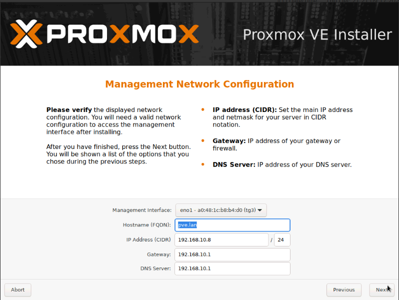
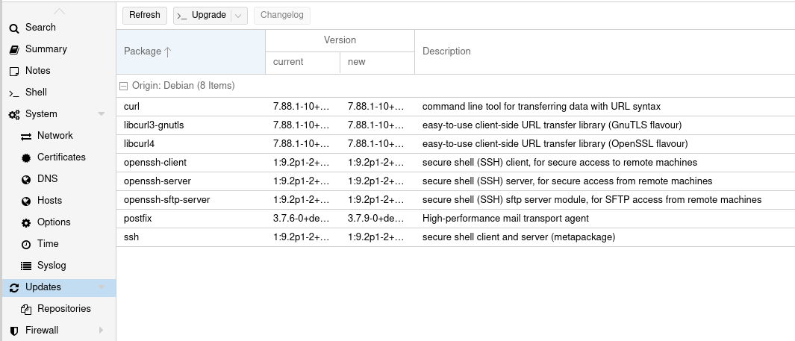

---

*Proxmox Virtual Environnement est une solution de virtualisation libre (licence AGPLv3) basée sur l'hyperviseur Linux KVM, et offre aussi une solution de conteneurs avec LXC. Elle propose un support payant.
Elle est fournie avec un packaging par Proxmox Server Solutions GmbH.*

*Proxmox est une solution de virtualisation de type « barre métal ».*

*L'installation de Proxmox VE s'effectue via une image ISO. L'installateur configure les éléments suivant :*

*Système d'exploitation complet (distribution Linux Debian stable 64 bits)
Partitionnement de disque dur avec LVM2
Support de LXC (conteneurs) et du module KVM (virtualisation complète)2,3
Outils de sauvegarde et de restauration
Interface web d'administration et de supervision.
Fonctions de clustering qui permet par exemple la migration à chaud des machines virtuelles d'un serveur physique à un autre (à condition d'utiliser un stockage partagé, SAN, ou Ceph sinon la migration entraîne une courte interruption lors du redémarrage sur un autre nœud du cluster).*

***Source :** Wikipédia*

---

Nous allons voir comment l'installer, créer notre première VM et ajouter une clé USB à celle-ci.

**Prérequis**
* Avoir récupéré la [dernière version de Proxmox](https://www.proxmox.com/en/downloads),
* Avoir une clé [USB Bootable avec Ventoy](/blog/ventoy_installation_update/) par exemple,
* Un NUC, Serveur ou autres avec minimum 8Go de RAM (ce n'est pas un impératif mais c'est plus confort)
* Un processeur acceptant la [Technologie de virtualisation Intel® (VT-x)](https://ark.intel.com/content/www/fr/fr/ark/search/featurefilter.html?productType=873&2_VTX=true)


## Installation
Démarrer sur votre clé USB puis sélectionner votre distribution Proxmox.

Une interface graphique s'ouvre, sélectionner `Install (Graphic mode)`

* Accepter la licence avec le bouton `I agree` en bas à droite.

* Sélectionnez le disque dur sur lequel vous souhaitez installer Proxmox
*Personnellement, je débranche tous les disques non utiles pour éviter les erreurs.*

* Sélectionnez votre Pays, le fuseau Horaire et la langue utilisée sur votre clavier.

* Saisir un mot de passe solide et un email (perso, je n'ai jamais rien reçu),

* Configurer le Hostname, ainsi que les informations réseaux,

* Vérifier que toutes les informations vous paraissent correctes.


L'installation se lance, il ne vous reste plus qu'à attendre.


## Découverte de l'interface
Une fois l'installation terminée, vous pouvez vous rendre sur l'interface via l'adresse suivante `https://votre_IP:8006`

Une fois sur l'interface, connectez-vous avec l'utilisateur `root` puis mettez le mot de passe que vous avez saisi pendant l'installation.


À gauche, vous avez le `Datacenter` avec le ou les `noeuds`, si vous avez plusieurs Proxmox en cluster. Le nœud sur la capture s'appelle `proxgen8`.

Dans la partie centrale, vous avez un menu sur les réglages disponibles du Datacenter et à droite les nœuds avec les métriques et les disques durs configurés.
Chaque nœud a ses stockages, mais des stockages réseaux peuvent être disponibles sur tous les nœuds (on y reviendra).

Des Machines Virtuelles (VM) ou des containers LXC peuvent être créés sur un nœud (mais pas sur un datacenter)

En haut à droite, vous avez des actions rapides comme créer une VM ou un container LXC, mais aussi l'ouverture d'un shell (Terminal) pour le nœud, la possibilité d'éteindre ou de redémarrer le nœud, etc.
Vous avez aussi accès à l'utilisateur connecté et pouvez modifier certains paramètres, thèmes ou changer de mot de passe.

### Mise à jour.
Pour mettre à jour votre Proxmox, vous devez aller dans le nœud, puis dans `Updates`.
Cliquez sur le bouton `Refresh`, puis sur `Upgrade`.

*Lors de votre première installation, vous pouvez avoir un popup vous disant que vous n'avez pas de souscription valide.*


Nous allons donc changer cela en remplaçant les sources dites "entreprise" par celles sans souscription.
*Pourquoi c'est comme ça par défaut, je ne sais pas, mais, il y a des gens qui ont fait des scripts pour modifier tout ça avec une seule ligne de commande.*

### Script Post Install TTeck
Nous allons donc lancer notre première ligne de commande dans le Shell du nœud en lançant le `script post Install` de [TTeck](https://tteck.github.io/Proxmox/) grâce à un simple copier-coller.


* Copier la ligne ci-dessous
```bash
bash -c "$(wget -qLO - https://github.com/tteck/Proxmox/raw/main/misc/post-pve-install.sh)"
```
* Rendez-vous dans le shell de votre nœud.
* Coller la ligne de commande, puis lancer le script avec la touche <span><kbd>ENTRÉE</kbd></span>

Je vous laisse suivre les informations à l'écran, mais en gros, vous pouvez cliquer sur `Yes` partout.

Il vous demandera de désactiver la haute disponibilité (si vous avez un seul nœud Proxmox)


À la fin, il vous proposera de mettre à jour Proxmox, sélectionnez `Yes` et ensuite, il vous demandera de redémarrer.

Votre Proxmox est maintenant à jour avec les réglages grand public (sources, etc).
*Si la mise à jour tourne en rond, vous pouvez quitter puis relancer le script, mais sans autoriser la mise à jour à la fin, ensuite il vous suffit de procéder directement comme indiqué un peu plus haut.*

## Conclusion
Le gros avantage d'un système de virtualisation est que vous pouvez utiliser les ressources complètes de votre machine et non pas la dédier à un seul service ou une seule tâche.
De plus, les sauvegardes, restaurations sont simplifiées, et vous pouvez mettre plusieurs systèmes d'exploitation en parallèle sans risque de casser quelque chose.

Sur le site de TTeck, il y a plein de VM ou de LXC installables à partir d'une simple ligne de commande, alors n'hésitez pas à y jeter un œil, tous les scripts sont consultables sur son GitHub.

## Sources :
* https://tteck.github.io/Proxmox/