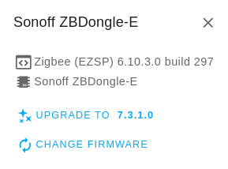
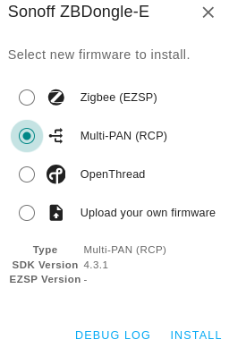
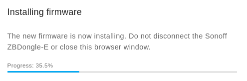
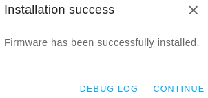
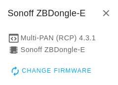
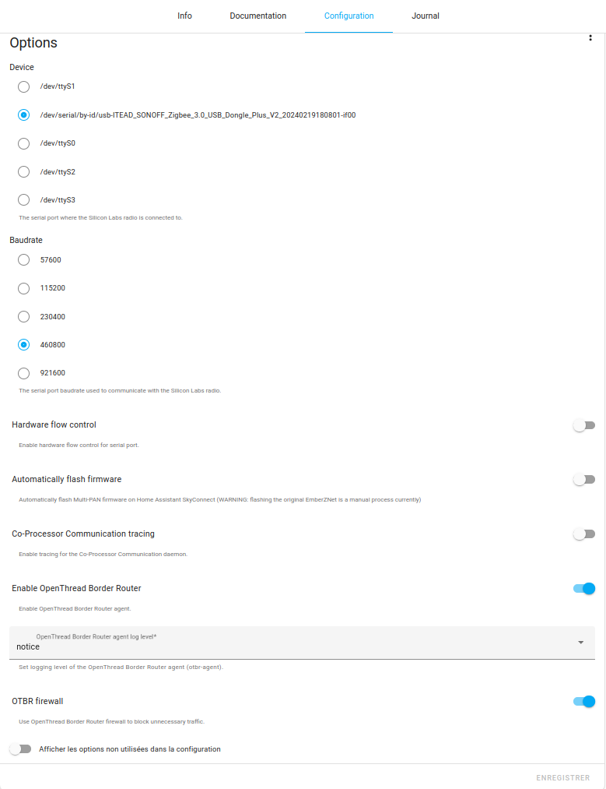

import Alert from "@components/mdx/Alert.astro";

La clé USB Sonoff ZBDongle E est basé sur une puce EFR32MG21 qui permet le support de Thread et du Zigbee.

Je ne vais pas vous cacher que je suis encore sceptique sur le protocole Thread. Cela fait quelques années que l'on nous en parle et on commence seulement à voir du matériel compatible.

Tout comme le Zigbee qui était aussi censé rendre tous les appareils interopérables, les constructeurs ont vite ajouté des surcouches ou ils se sont autorisé des fantaisies dans le codage pour le rendre inopérable avec les concurrents. Bien sûr, ce n'est qu'une histoire de gros sous.

Si le "protocole" Thread arrive avec ce qu'il promet, ce sera une très grosse avancée pour la domotique.

**Qu'est-ce que Thread** (très rapidement) **:**

Thread est un protocole réseau maillé conçu pour la domotique. Il permet aux appareils de communiquer entre eux de manière sécurisée et efficace, sans avoir à passer par un routeur Wi-Fi ou un hub central.

*Je ferais peut-être un article dessus, mais plus tard, car comme je vous l'ai dit, je suis sceptique.*

Pour en savoir plus, il y a déjà pas mal de source sur le web dont [celle-ci du site Domadoo](https://blog.domadoo.fr/89279-thread-protocole-domotique-matter/)

Revenons à nos moutons !!!

<Alert type="warning">Si votre coordinateur actuel est le ZBDongle E, il vous faudra tout appairer à nouveau après le flash du firmware. Le **flash peut comporter des risques**, à vous de les assumer</Alert>

Je vais vous montrer la méthode permettant de flasher la clé Sonoff directement depuis un navigateur compatible WebSerial API comme Chrome/Chromium ou Edge.

La manipulation est relativement simple.

**Matériels utilisés :**

* Sonoff ZBDongle E [Domadoo](https://www.domadoo.fr/fr/interface-domotique/6315-sonoff-zbdongle-e-cle-usb-dongle-zigbee-30-antenne-externe-20dbm-v2.html?domid=66), [Amazon](https://amzn.to/3UpzWPX), [AliExpress](https://s.click.aliexpress.com/e/_DmnOkph)
* Chromium v124.0.6367.207,
* HA 2024.5.4 / 12.3
* Zigbee2MQTT 1.37.1
* Silicon Labs Multiprotocol 2.4.5

## Flash du Firmware Multi protocole.

### Depuis le navigateur

1. Brancher le dongle Sonoff sur votre PC,
2. Rendez-vous a [cette adresse](https://darkxst.github.io/silabs-firmware-builder/) depuis un navigateur compatible WebSerial API,

   

   Si votre navigateur n'est pas compatible, vous devez avoir ce message.

   
3. Cliquez sur le bouton "CONNECT" sous la clé Sonoff puis sélectionnez votre clé.

<Alert type="info">Si vous avez un navigateur compatible, mais que vous ne voyez pas votre ZBDongle, essayez cela. *Sous Windows ou Mac* vérifiez que vous avez bien le [driver CP2102](https://www.silabs.com/developers/usb-to-uart-bridge-vcp-drivers?tab=downloads) d'installé. *Sous Ubuntu* vérifier les autorisations de Chromium depuis l'Ubuntu Store (recherchez Chromium et cliquez sur Permissions) car "Access USB hardware directly" n'est pas activé par défaut.</Alert>

Une fois connecté, vous devez avoir toutes les informations de votre clé



4. Cliquez sur `CHANGE FIRMWARE`,
5. Sélectionnez Muti-PAN (RCP) dans la fenêtre qui s'affiche et cliquez sur `INSTALL`,







6. Cliquez sur CONTINUE et vous devriez avoir votre nouveau firmware d'affiché.

   
7. Au moment où j'écris, le firmware installé par le navigateur web est le 4.3.1, mais vous pouvez mettre le dernier qui est le 4.4.2 et qui se trouve [ici](https://github.com/darkxst/silabs-firmware-builder/tree/main/firmware_builds/zbdonglee) (Prendre le`rcp-uart-802154-v4.4.2-zbdonglee-460800.gbl` ou plus récent s'il y a.
8. Ensuite, suivez de nouveau le tuto à partir de l'étape 1 et choisissez `Upload your own firmware`, cliquez sur `UPLOAD` et sélectionnez le firmware que vous souhaitez installer.

<Alert type="warning">A date de l'écriture de cet article, il semble que le 4.3.1 semble le seul firmware fonctionnant avec l'add-on Silicon Labs Multiprotocol</Alert>

### Flash depuis l'Add-on Zigstar

Vous vous souvenez peut-être que j'ai fait un article sur le [flash de la clé Sonoff ZBDongle mais la version **P**](/blog/ha_flasher_sonoff_zigbee/) pour enlever la limite du nombre d'appareils imposé par Sonoff ? Eh bien, je n'ai pas réussi à flasher la Sonoff ZBDongle depuis cet add-on, si vous avez réussi la manip, je suis preneur.

## Configuration sous Home Assistant

Maintenant que notre clé est flashée avec le dernier firmware Multi protocole, nous allons devoir la configurer dans Home Assistant.

Nous allons d'abord ajouter un add-on, nommé Silicon Labs Multiprotocol, qui permet de créer des réseaux séparés en utilisant le firmware RCP Multi-PAN sur la Sonoff et servira de passerelle entre votre clé et Home Assistant.

### Add-on Silicon Labs MultiProtocol

Comme d'habitude, `Paramètres -> Modules complémentaires -> Boutique des modules complémentaires`, recherchez `Silicon Labs Multiprotocol` et installez-le.

Passons à la configuration de celui-ci :

* Sélectionnez votre clé,
* Baudrate 460800,
* Désactivez `Hardware Flow Control`, `Automatically flash firmware` et `Co-Processor Communication tracing`,
* Activez `Enable OpenThread Border Router` et `OTBR firewall`,
* Laissez le reste par défaut, **sauvegardez** et lancez l'add-on.



Voici mes logs :

```yaml
-----------------------------------------------------------
 Add-on: Silicon Labs Multiprotocol
 Zigbee and OpenThread multiprotocol add-on
-----------------------------------------------------------
 Add-on version: 2.4.5
 You are running the latest version of this add-on.
 System: Home Assistant OS 12.3  (amd64 / qemux86-64)
 Home Assistant Core: 2024.5.4
 Home Assistant Supervisor: 2024.05.1
-----------------------------------------------------------
 Please, share the above information when looking for help
 or support in, e.g., GitHub, forums or the Discord chat.
-----------------------------------------------------------
s6-rc: info: service banner successfully started
s6-rc: info: service universal-silabs-flasher: starting
[00:59:59] INFO: Flashing firmware is disabled
s6-rc: info: service universal-silabs-flasher successfully started
s6-rc: info: service cpcd-config: starting
[00:59:59] INFO: Generating cpcd configuration.
WARNING in function 'main' in file /usr/src/cpc-daemon/main.c at line #186 : Running CPCd as 'root' is not recommended. Proceed at your own risk.
s6-rc: info: service cpcd successfully started
s6-rc: info: service zigbeed: starting
s6-rc: info: service otbr-agent: starting
s6-rc: info: service zigbeed successfully started
[00:59:02] INFO: Starting zigbeed...
[00:59:02] INFO: Setup OTBR firewall...
[00:59:02] INFO: Starting otbr-agent...
otbr-agent[300]: [NOTE]-AGENT---: Running 0.3.0
otbr-agent[300]: [NOTE]-AGENT---: Thread version: 1.3.0
otbr-agent[300]: [NOTE]-AGENT---: Thread interface: wpan0
otbr-agent[300]: [NOTE]-AGENT---: Radio URL: spinel+cpc://cpcd_0?iid=2&iid-list=0
otbr-agent[300]: [NOTE]-ILS-----: Infra link selected: enp0s18
otbr-agent[300]: 49d.18:27:26.395 [C] Platform------: mCpcBusSpeed = 115200
[00:59:01:856025] Info : [CPCd v4.3.1.0] [Library API v3] [RCP Protocol v4]
[00:59:01:856077] Info : Git commit: 133b29678b3d0bc7578e098d2f46b4d5bcd2ebb4 / branch: 
[00:59:01:856079] Info : Sources hash: ff8300587e7e4ab1def7a89a272c0baef32f9eb3bff9b0ba06b94e655d652367
[00:59:01:856084] WARNING : In function 'main' in file /usr/src/cpc-daemon/main.c at line #186 : Running CPCd as 'root' is not recommended. Proceed at your own risk.
[00:59:01:856095] Info : Reading cli arguments
[00:59:01:856097] Info : /usr/local/bin/cpcd 
[00:59:01:857013] Info : Reading configuration
[00:59:01:857016] Info :   file_path = /usr/local/etc/cpcd.conf
[00:59:01:857017] Info :   instance_name = cpcd_0
[00:59:01:857017] Info :   socket_folder = /dev/shm
[00:59:01:857018] Info :   operation_mode = MODE_NORMAL
[00:59:01:857018] Info :   use_encryption = false
[00:59:01:857019] Info :   binding_key_file = /etc/binding-key.key
[00:59:01:857019] Info :   stdout_tracing = false
[00:59:01:857020] Info :   file_tracing = false
[00:59:01:857020] Info :   lttng_tracing = false
[00:59:01:857021] Info :   enable_frame_trace = false
[00:59:01:857021] Info :   traces_folder = /dev/shm/cpcd-traces
[00:59:01:857021] Info :   bus = UART
[00:59:01:857022] Info :   uart_baudrate = 460800
[00:59:01:857023] Info :   uart_hardflow = false
[00:59:01:857023] Info :   uart_file = /dev/ttyACM0
[00:59:01:857023] Info :   fu_recovery_pins_enabled = false
[00:59:01:857024] Info :   fu_connect_to_bootloader = false
[00:59:01:857024] Info :   fu_enter_bootloader = false
[00:59:01:857025] Info :   restart_cpcd = false
[00:59:01:857025] Info :   application_version_validation = false
[00:59:01:857026] Info :   print_secondary_versions_and_exit = false
[00:59:01:857026] Info :   use_noop_keep_alive = false
[00:59:01:857026] Info :   reset_sequence = true
[00:59:01:857027] Info :   stats_interval = 0
[00:59:01:857027] Info :   rlimit_nofile = 2000
[00:59:01:857028] Info : ENCRYPTION IS DISABLED 
[00:59:01:857029] Info : Starting daemon in normal mode
[00:59:01:868200] Info : Connecting to Secondary...
[00:59:01:942433] Info : RX capability is 256 bytes
[00:59:01:942443] Info : Connected to Secondary
[00:59:01:944346] Info : Secondary Protocol v4
[00:59:01:948541] Info : Secondary CPC v4.3.1
[00:59:01:950522] Info : Secondary bus bitrate is 460800
[00:59:01:954397] Info : Secondary APP vUNDEFINED
[00:59:01:954451] Info : Daemon startup was successful. Waiting for client connections
[00:59:02:470494] Info : New client connection using library v4.3.1.0
[00:59:02:472827] Info : Opened connection socket for ep#12
[00:59:02:472988] Info : Endpoint socket #12: Client connected. 1 connections
[00:59:03:277345] Info : New client connection using library v4.3.1.0
[00:59:03:280160] Info : Endpoint socket #12: Client connected. 2 connections
otbr-agent[300]: 00:00:00.029 [N] RoutingManager: No valid /48 BR ULA prefix found in settings, generating new one
otbr-agent[300]: 00:00:00.039 [N] RoutingManager: BR ULA prefix: fd7c:e06a:e652::/48 (generated)
otbr-agent[300]: 00:00:00.039 [N] RoutingManager: Local on-link prefix: fdde:ad00:beef:cafe::/64
s6-rc: info: service otbr-agent successfully started
s6-rc: info: service otbr-agent-rest-discovery: starting
Default: mDNSCoreReceiveResponse: Received from 192.168.10.10:5353    4 homeassistant.local. Addr 192.168.10.10
Default: mDNSCoreReceiveResponse: ProbeCount 2; restarting probing after 1024-tick pause due to possibly spurious multicast conflict (1/1) via interface 629646304 for    4 homeassistant.local. Addr 192.168.10.13
Default: mDNSCoreReceiveResponse: Received from 192.168.10.10:5353    4 homeassistant.local. Addr 192.168.10.10
Default: mDNSCoreReceiveResponse: ProbeCount 2; restarting probing after 1024-tick pause due to possibly spurious multicast conflict (1/1) via interface 629646304 for   16 homeassistant.local. AAAA 2a01:e0a:c51:b740:b5a7:d3fb:9ad9:b5b6
Default: mDNSCoreReceiveResponse: Received from 192.168.10.10:5353    4 homeassistant.local. Addr 192.168.10.10
Default: mDNSCoreReceiveResponse: ProbeCount 2; restarting probing after 1024-tick pause due to possibly spurious multicast conflict (1/1) via interface 629646304 for   16 homeassistant.local. AAAA fe80::150e:998e:e522:12b1
Default: mDNSCoreReceiveResponse: Received from 172.30.32.1:5353    4 homeassistant.local. Addr 192.168.10.10
Default: mDNSCoreReceiveResponse: ProbeCount 2; restarting probing after 1024-tick pause due to possibly spurious multicast conflict (1/1) via interface 629652592 for    4 homeassistant.local. Addr 172.30.32.1
Default: mDNSCoreReceiveResponse: Received from 172.30.32.1:5353    4 homeassistant.local. Addr 192.168.10.10
Default: mDNSCoreReceiveResponse: ProbeCount 2; restarting probing after 1024-tick pause due to possibly spurious multicast conflict (1/1) via interface 629652592 for   16 homeassistant.local. AAAA fe80::42:ebff:fe49:dc25
otbr-agent[300]: 00:00:00.292 [N] RoutingManager: Local on-link prefix: fda3:d3a9:8d95:d438::/64
otbr-agent[300]: 00:00:00.300 [N] Mle-----------: Role disabled -> detached
otbr-agent[300]: 00:00:00.301 [N] Platform------: [netif] Changing interface state to up.
[00:59:04] INFO: Successfully sent discovery information to Home Assistant.
s6-rc: info: service otbr-agent-rest-discovery successfully started
s6-rc: info: service legacy-services: starting
s6-rc: info: service legacy-services successfully started
Default: mDNSCoreReceiveResponse: Received from 192.168.10.10:5353    4 homeassistant.local. Addr 192.168.10.10
Default: mDNSCoreReceiveResponse: ProbeCount 2; restarting probing after 1024-tick pause due to possibly spurious multicast conflict (1/1) via interface 629646304 for    4 homeassistant.local. Addr 192.168.10.13
Default: mDNSCoreReceiveResponse: Received from 192.168.10.10:5353    4 homeassistant.local. Addr 192.168.10.10
Default: mDNSCoreReceiveResponse: ProbeCount 2; restarting probing after 1024-tick pause due to possibly spurious multicast conflict (1/1) via interface 629646304 for   16 homeassistant.local. AAAA 2a01:e0a:c51:b740:b5a7:d3fb:9ad9:b5b6
Default: mDNSCoreReceiveResponse: Received from 192.168.10.10:5353    4 homeassistant.local. Addr 192.168.10.10
Default: mDNSCoreReceiveResponse: ProbeCount 2; restarting probing after 1024-tick pause due to possibly spurious multicast conflict (1/1) via interface 629646304 for   16 homeassistant.local. AAAA fe80::150e:998e:e522:12b1
Default: mDNSCoreReceiveResponse: Received from 172.30.32.1:5353    4 homeassistant.local. Addr 192.168.10.10
Default: mDNSCoreReceiveResponse: ProbeCount 2; restarting probing after 1024-tick pause due to possibly spurious multicast conflict (1/1) via interface 629652592 for    4 homeassistant.local. Addr 172.30.32.1
Default: mDNSCoreReceiveResponse: Received from 172.30.32.1:5353    4 homeassistant.local. Addr 192.168.10.10
Default: mDNSCoreReceiveResponse: ProbeCount 2; restarting probing after 1024-tick pause due to possibly spurious multicast conflict (1/1) via interface 629652592 for   16 homeassistant.local. AAAA fe80::42:ebff:fe49:dc25
otbr-agent[300]: 00:00:01.027 [N] Mle-----------: Attach attempt 1, AnyPartition reattaching with Active Dataset
Default: mDNSCoreReceiveResponse: Received from 192.168.10.10:5353    4 homeassistant.local. Addr 192.168.10.10
Default: mDNSCoreReceiveResponse: ProbeCount 2; will deregister    4 homeassistant.local. Addr 192.168.10.13 due to multicast conflict via interface 629646304
Default: Local Hostname homeassistant.local already in use; will try homeassistant-2.local instead
Listening on port 9999 for connection...
Accepting connection.
otbr-agent[300]: 00:00:07.528 [N] RouterTable---: Allocate router id 62
otbr-agent[300]: 00:00:07.529 [N] Mle-----------: RLOC16 fffe -> f800
otbr-agent[300]: 00:00:07.531 [N] Mle-----------: Role detached -> leader
otbr-agent[300]: 00:00:07.531 [N] Mle-----------: Partition ID 0x4d2ec7c1
otbr-agent[300]: [NOTE]-BBA-----: BackboneAgent: Backbone Router becomes Primary!
```

### Ajout de ZHA

Si vous souhaitez ajouter ZHA (au lieu de Zigbee2MQTT).
Allez dans `Parametres -> Appareils et services -> AJOUTER UNE INTEGRATION` rechercher ZHA.
Cliquez dessus et sélectionné `Configurer une nouvelle instance de Zigbee Home Automation` puis `socket://core-silabs-multiprotocol:9999`.

Ensuite, créez un réseau ou récupérez le vôtre.

### Ajout de Zigbee2MQTT

Pour utiliser Zigbee2MQTT, vous devez suivre en partie [mon tuto](/blog/ha_mosquitto_broker_zigbee2mqtt/), mais dans la configuration de l'add-on il va falloir remplacer les paramètres du `port` (dongle) par ceux ci-dessous.

```yaml
port: tcp://core-silabs-multiprotocol:9999
adapter: ezsp
```

Enregistrez puis démarrez l'add-on.

<Alert type="info">Malgré le fait que \`ezsp\` soit marqué comme déprécié, il ne faut pas le remplacer par \`ember\` comme mentionné, car cela rend le Multi-PAN complètement instable, voir [cette discussion sur GitHub](https://github.com/Koenkk/zigbee2mqtt/issues/22635) qui annonce qu'Home Assistant a annoncé qu'il n'y aurait plus de développement parce que le firmware RCP impose certaines limitations et difficultés lorsque Thread et Zigbee sont utilisés sur la même radio.</Alert>

Voici mes logs :

```
[10:11:31] INFO: Preparing to start...
[10:11:31] INFO: Socat not enabled
[10:11:32] INFO: Starting Zigbee2MQTT...
[2024-05-19 10:11:33] info: 	z2m: Logging to console, file (filename: log.log)
[2024-05-19 10:11:33] info: 	z2m: Starting Zigbee2MQTT version 1.37.1 (commit #unknown)
[2024-05-19 10:11:33] info: 	z2m: Starting zigbee-herdsman (0.46.6)
[2024-05-19 10:11:33] warning: 	zh:ezsp: Deprecated driver 'ezsp' currently in use, 'ember' will become the officially supported EmberZNet driver in next release. If using Zigbee2MQTT see https://github.com/Koenkk/zigbee2mqtt/discussions/21462
[2024-05-19 10:11:38] error: 	zh:ezsp:ezsp: Command (setValue(EzspValueId.VALUE_CCA_THRESHOLD, 0)) returned unexpected state: {"_cls_":"setValue","_id_":171,"_isRequest_":false,"status":55}
[2024-05-19 10:11:38] error: 	zh:ezsp:ezsp: Failure to init network
[2024-05-19 10:11:38] info: 	zh:ezsp:driv: Form network
[2024-05-19 10:11:40] info: 	zh:controller: Wrote coordinator backup to '/config/zigbee2mqtt/coordinator_backup.json'
[2024-05-19 10:11:40] info: 	z2m: zigbee-herdsman started (reset)
[2024-05-19 10:11:40] info: 	z2m: Coordinator firmware version: '{"meta":{"maintrel":"1 ","majorrel":"7","minorrel":"3","product":12,"revision":"7.3.1.0 build 0"},"type":"EZSP v12"}'
[2024-05-19 10:11:40] info: 	z2m: Currently 0 devices are joined:
[2024-05-19 10:11:40] info: 	z2m: Zigbee: disabling joining new devices.
[2024-05-19 10:11:40] info: 	z2m: Connecting to MQTT server at mqtt://core-mosquitto:1883
[2024-05-19 10:11:40] info: 	z2m: Connected to MQTT server
[2024-05-19 10:11:40] info: 	z2m: Started frontend on port 8099
[2024-05-19 10:11:40] info: 	z2m: Zigbee2MQTT started!
```

Ensuite, vous pouvez continuer de suivre [le tuto sur Zigbee2MQTT](/blog/ha_mosquitto_broker_zigbee2mqtt/).

### Thread

Pour Thread, normalement, il a automatiquement été ajouté dans vos appareils et services. Dans le cas contraire, rendez-vous dans `Paramètres -> Appareils et services` puis `AJOUTER UNE INTÉGRATION`. Recherchez Thread et sélectionnez votre clé Sonoff ZBDongle E.

## Flasher le firmware pour Thread

*Pas besoin de suivre ces étapes si vous souhaitez faire du Multi-PAN*

Si vous souhaitez juste flasher votre Sonoff ZBDongle E avec le firmware Thread uniquement, la procédure est la même. Il vous faudra juste sélectionner le firmware OpenThread.


## Remettre le firmware Zigbee

Pour remettre le firmware Zigbee sur votre Sonoff ZBDongle E , suivez la même procédure, mais en choisissant le firmware Zigbee (EZSP).


## Conclusion

Il est vrai que j'ai acheté la ZBDongle E seulement pour tester ce multiprotocole, ma ZBDongle P marche super bien. Après plusieurs recherches, je ne pense pas qu'il y aura de grosses évolutions du firmware RCP.

Les retours semblent globalement bons et sans problème pour le moment. Maintenant, pour une installation en production, je vous suggère plutôt d'avoir une clé pour le Zigbee et une autre pour Thread afin d'avoir une installation vraiment stable.

Si vous souhaitez essayer d'autres versions de firmware que ceux qui sont avec le WebFlasher, retenez que les firmwares commençant par :

* `ncp-uart-hw-` sont pour le Zigbee (ember) seul,
* `rcp-uart-802154-` sont pour le MultiPan (Zigbee + Thread),
* `ot-rcp-` sont pour OpenThread seul.

À la fin du nom de firmware, il y a le Baudrate.

Pour la Sonoff ZBDOngle E, il faut :

* `ncp-uart-hw-` prendre la version 115200,
* `rcp-uart-802154-` prendre la version 460800,
* `ot-rcp-` prendre la version 460800.

### Sources

* [Firmware Builder](https://darkxst.github.io/silabs-firmware-builder/)
* [Les firmwares](https://github.com/darkxst/silabs-firmware-builder/tree/main)
* [SmartHomeScene](https://smarthomescene.com/guides/how-to-enable-thread-and-matter-support-on-sonoff-zbdongle-e/)(pour la partie intégration HA)
* [Ember et MultiPAN](https://github.com/Koenkk/zigbee2mqtt/issues/22635)
