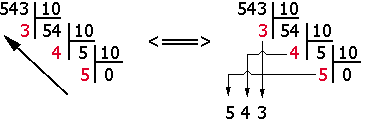
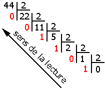
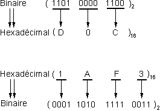
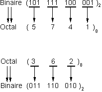
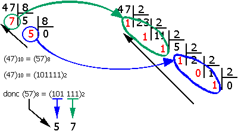
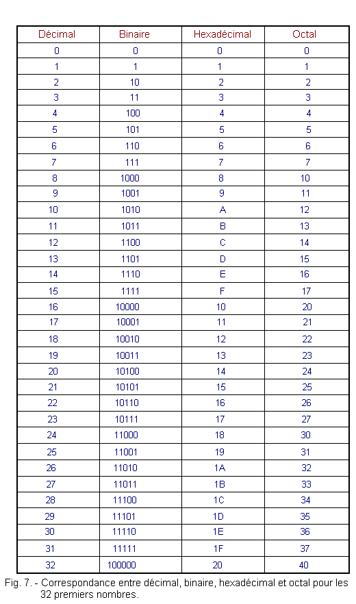

import Alert from "@components/mdx/Alert.astro";

Comme vous le savez, un ordinateur fonctionne en binaire, ça veut dire une suite de 0 et de 1. Parfois, certains matériels peuvent travailler en Hexadécimal ou en Octal.

Pour la bonne compréhension des prochains articles sur les adresses IP V4 et V6, nous allons revoir les bases du calcul numérique (c'est surtout pour me faire une note écrite ;)). Le calcul décimal, binaire, octal ou hexadécimal et le passage de l'un a l'autre n'aura plus de secret pour vous.

Que l'on soit dans n'import quelle base, il faudra additionner chaque chiffre par la base B exposant N en fonction de sa position, en partant de la droite vers la gauche. Sachez aussi que le premier exposant sera 0 puis 1,2,3,4,5, etc.

Exemple général : 246 en base B donne 2\*B^2 + 4\*B^1 + 6*B^0.

<Alert type="info">^0 revient à multiplier par 1</Alert>

Commençons par la base que nous connaissons tous le calcul en base décimale.

## La base 10 (décimale)

Le calcul décimal se réfère aux opérations mathématiques effectuées dans le système de numération décimal, qui est le système de numération le plus utilisé au quotidien. Ce système est basé sur dix chiffres (0 à 9) et fonctionne en base 10. Chaque chiffre dans un nombre a une position qui représente une puissance de 10.

### Principes de base du système décimal

Base 10 : Le système décimal est un système de numération en base 10, ce qui signifie qu'il utilise dix chiffres différents (0, 1, 2, 3, 4, 5, 6, 7, 8, 9).

Position des chiffres : Dans un nombre décimal, chaque chiffre a une position qui détermine sa valeur. Par exemple, dans le nombre 345:

Le chiffre 5 est dans la position des unités (10^0),

Le chiffre 4 est dans la position des dizaines (10^1),

Le chiffre 3 est dans la position des centaines (10^2).

Le nombre peut donc être décomposé comme suit :

345=3×10^2+4×10^1+5×10^0

## La base 2 (Binaire)

### Principes de base du système binaire

Le calcul binaire est une méthode de calcul dans laquelle les nombres sont représentés en base 2, utilisant uniquement les chiffres 0 et 1. Ce système est fondamental en informatique et dans les systèmes numériques, car les ordinateurs utilisent le binaire pour traiter et stocker des données.

Chaque chiffre (appelé "bit") dans un nombre binaire a une position correspondant à une puissance de 2. 

Par exemple, dans le nombre binaire 1011 base 2 :

Le bit le plus à droite est 1*2^0 donc =1

Le deuxième bit à partir de la droite est 1*2^1 = 2

Le troisième bit est 0*2^2 = 0

Le quatrième bit est 1*2^3 = 8

Le nombre 1011 en binaire équivaut à : 1×8+0×4+1×2+1×1 = 11 base 10

### Conversion entre le binaire et le décimal

**Décimal à Binaire :** Divisez le nombre décimal par 2, notez le reste, et continuez jusqu'à ce que le quotient soit 0. Les restes lus à l'envers donnent le nombre binaire.

**Binaire à Décimal :** Multipliez chaque bit par sa puissance de 2 correspondante et additionnez les résultats.

### Utilisation du système binaire

Le système binaire est crucial pour l'informatique, car les ordinateurs utilisent des bits (0 et 1) pour représenter et manipuler toutes sortes d'informations, des données numériques aux instructions de traitement.

En résumé, le calcul binaire est simple en termes de règles, mais extrêmement puissant, ainsi, il constitue la base du fonctionnement des systèmes informatiques.

## La base 16 (Hexadécimale)

### Principes de base du système hexadécimal

La base hexadécimale est un système de numération en base 16, ce qui signifie qu'elle utilise seize symboles différents pour représenter les valeurs. Ces symboles sont les **chiffres de 0 à 9** et les **lettres de A à F**, où A représente 10, B représente 11, et ainsi de suite jusqu'à F, qui représente 15. Ce système est très utilisé en informatique et en électronique, car il offre une manière compacte de représenter les nombres binaires.

Les chiffres utilisés sont 0, 1, 2, 3, 4, 5, 6, 7, 8, 9, A (10), B (11), C (12), D (13), E (14), et F (15). Chaque chiffre dans un nombre hexadécimal représente une puissance de 16. 

Par exemple, dans le nombre hexadécimal 3A7F₁₆ :

Le chiffre F représente 15 et est à la position des unités (16^0),

Le chiffre 7 est à la position des seizièmes (16^1),

Le chiffre A (10 en décimal) est à la position des deux-cent-cinquante-sixièmes (16^2),

Le chiffre 3 est à la position des quatre-mille-quatre-vingt-seizièmes (16^3).

Le nombre 3A7F₁₆ peut être converti en décimal comme suit :

3𝐴7𝐹 base 16 = 3×16^3 + 10×16^2 + 7×16^1 + 15×16^0 =14975 en base 10

### Conversion entre hexadécimal et d'autres systèmes

**Hexadécimal à Binaire :** Chaque chiffre hexadécimal correspond à un groupe de quatre bits (par exemple, F₁₆ = 1111₂).

Exemple : 3A7F₁₆ = 0011 1010 0111 1111₂

**Binaire à Hexadécimal :** Regroupez les bits en groupes de quatre, en commençant par la droite, et convertissez chaque groupe en un chiffre hexadécimal.

Exemple : 1 1010 1111₂ = 1AF₁₆

**Hexadécimal à Décimal :** Multipliez chaque chiffre hexadécimal par la puissance de 16 correspondante et additionnez les résultats.

Exemple : 1C3₁₆ = 1×16^2 + 12×16^1 + 3×16^0 = 451₁₀

**Décimal à Hexadécimal :** Divisez le nombre décimal par 16, en notant les restes. Lisez les restes de bas en haut pour obtenir le nombre hexadécimal.

Exemple : 451₁₀ = 1C3₁₆

### Utilisation du système hexadécimal

Le système hexadécimal est couramment utilisé en informatique pour représenter les adresses mémoire, les couleurs en CSS (par exemple, #FFFFFF pour le blanc), les adresses IP V6 et d'autres données compactes. Sa principale utilité vient du fait qu'il est beaucoup plus compact que le binaire et plus facile à convertir directement en binaire que le système décimal.

En résumé, la base hexadécimale est un système de numération efficace et pratique pour représenter des informations binaires de manière condensée et lisible. Elle est essentielle dans le domaine de l'informatique et des technologies numériques.

## La base 8 (Octale)

### Principes de base du système octal

La base octale est un système de numération en base 8, ce qui signifie qu'il utilise huit chiffres distincts : 0, 1, 2, 3, 4, 5, 6, et 7. Chaque chiffre en position dans un nombre octal représente une puissance de 8. Le système octal est moins couramment utilisé que les systèmes décimal ou binaire, mais il a une importance historique en informatique et en électronique, notamment pour représenter de manière compacte les nombres binaires.

Par exemple, dans le nombre octal 745₈ :

Le chiffre 5 est en position des unités (8^0),

Le chiffre 4 est en position des huitièmes (8^1),

Le chiffre 7 est en position des soixante-quatrièmes (8^2).

Le nombre 745₈ peut donc être décomposé en :

745 en base 8 =7×8^2+4×8^1+5×8^0= 485 en base 10

### Conversion entre octal et d'autres systèmes

**Octal à Binaire :** Chaque chiffre octal peut être directement converti en un groupe de trois bits (par exemple, 7₈ = 111₂).

Exemple : 745₈ = 111 100 101₂

**Binaire à Octal :** Regroupez les bits par trois, en commençant par la droite, et convertissez chaque groupe en un chiffre octal.

Exemple : 110 101₂ = 65₈

**Octal à Décimal :** Multipliez chaque chiffre octal par la puissance de 8 correspondante et additionnez les résultats.

Exemple : 57₈ = 5×8 + 7×1 = 47₁₀

**Décimal à Octal :** Divisez le nombre décimal par 8, en notant les restes. Lisez les restes de bas en haut pour obtenir le nombre octal.

Exemple : 485₁₀ = 745₈

**Utilisation du système octal**

Le système octal a été utilisé historiquement en informatique pour représenter les nombres binaires de manière plus compacte, surtout à une époque où les calculatrices et les ordinateurs utilisaient des groupes de 3 bits. Bien qu'il soit moins utilisé aujourd'hui, il reste utile pour certaines applications en électronique et en programmation bas niveau.

En résumé, la base octale est un système de numération pratique qui permet une représentation plus concise des nombres binaires et simplifie certaines opérations informatiques.

## Conclusion

Nous venons de voir un léger rappel sur le calcul et la conversion de différents nombres binaire, hexadécimal, décimal et octal. 

N'hésitez pas à consulter d'autre contenu et faire des exercices, car nous en aurons besoin pour les adresses IP V4 et V6.

Voici un tableau de conversion entre Décimal, Binaire, Héxa et Octal.

*Sources : https://electronique-et-informatique.fr/Electronique-et-Informatique/Digit/Digit_7T.php*

### Sources

* [Playlist YouTube](https://www.youtube.com/playlist?list=PL2aehqZh72Ltwujnj3NOR53oGPjmfupxU) (vidéos 1 à 5) de Mohamed Chiny,
* [Cours Positron Libre](https://www.positron-libre.com/cours/electronique/systeme-numeration/conversion-decimal-binaire-hexadecimal.php) (source de mes images),
* [Cours sur Électronique et Informatique](https://electronique-et-informatique.fr/Electronique-et-Informatique/Digit/Digit_7T.php).
