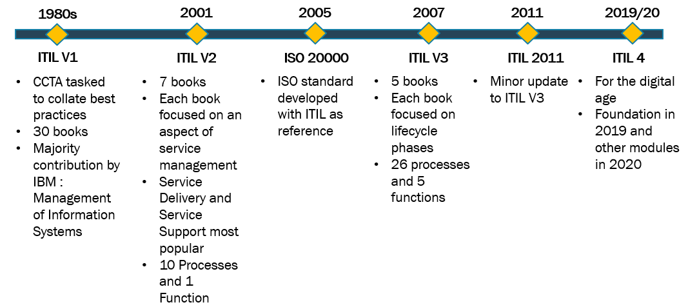

ITIL signifie "Information Technology Infrastructure Library". C'est un ensemble de pratiques détaillées pour la gestion des services informatiques (Information Technology Service Management). ITIL fournit un cadre complet pour aligner les services informatiques sur les besoins des entreprises et des clients.

ITIL est structuré autour de cinq aspects principaux, chacun représentant une phase du cycle de vie des services IT. 

Ces pratiques aident les organisations à améliorer leur efficacité opérationnelle, à réduire les coûts et à augmenter la satisfaction des clients.

## L'historique

 ITIL a évolué au fil des années pour s'adapter aux changements dans le domaine des technologies de l'information.

**Années 1980 :** ITIL est créé par la Central Computer and Telecommunications Agency (CCTA) du gouvernement britannique. Il est composé de 30 livres. L'objectif initial était d'améliorer la gestion des services IT dans les agences gouvernementales.

**Années 1990 :** ITIL gagne en popularité dans le secteur privé. La première version complète d'ITIL est publiée, comprenant 31 volumes.

**2000-2001 :** Publication d'ITIL V2, consolidant les volumes en huit ensembles logiques. Cette version met l'accent sur le service support et le service délivré.

**2007 :** ITIL V3. Introduction du concept de cycle de vie des services. Réorganisation en cinq volumes principaux : 

1. Stratégie,
2.  Conception,
3. Transition,
4. Exploitation,
5. Amélioration continue.

**2011 :** ITIL 2011 Edition. Mise à jour de ITIL V3 avec des clarifications et des améliorations mineures.

**2019 :** ITIL 4. Refonte majeure pour s'adapter aux nouvelles méthodes de travail comme Agile, DevOps, et Lean.

Introduction du Système de Valeur des Services (SVS) et des quatre dimensions du management des services.

**2020-2022 :** Expansion d'ITIL 4 avec des publications spécialisées comme ITIL 4 Leader, Digital and IT Strategy, etc.

ITIL est maintenant géré par Axelos, une coentreprise entre le Cabinet Office du gouvernement britannique et Capita plc.

Cette évolution montre comment ITIL s'est adapté au fil du temps pour rester pertinent face aux changements technologiques et organisationnels.

## Les certifications

Les certifications ITIL sont largement reconnues dans l'industrie IT et offrent une validation des compétences en gestion des services IT. Basées sur ITIL 4, oici un aperçu des certifications actuelles :

**ITIL 4 Foundation :** Niveau d'entrée. Couvre les concepts de base d'ITIL 4 et est un prérequis pour les niveaux supérieurs.

**ITIL 4 Managing Professional (MP) :** En quatre modules :

* a. Create, Deliver and Support
* b. Drive Stakeholder Value
* c. High Velocity IT
* d. Direct, Plan and Improve

**ITIL 4 Strategic Leader (SL) :** Deux modules :

a. Direct, Plan and Improve

b. Digital and IT Strategy

**ITIL 4 Master :** Niveau le plus élevé

Nécessite une expérience significative et la réussite des niveaux précédents

**ITIL 4 Extension Modules :**

* Durabilité dans le numérique et l'IT
* Acquisition et gestion des services cloud 

**ITIL 4 Practice Modules :** Certifications spécialisées pour des pratiques spécifiques

## ITIL en détails

### Les aspects

#### Stratégie de service

Elle définit la perspective, la position, les plans et les modèles à suivre pour atteindre les objectifs commerciaux. Elle comprend la gestion financière, la gestion de la demande et la gestion du portefeuille de services.

#### Conception de service

Elle se concentre sur la création de services IT qui répondent aux besoins actuels et futurs de l'entreprise. Elle inclut la gestion du catalogue de services, la gestion des niveaux de service, la gestion de la capacité et la gestion de la disponibilité.

#### Transition de service

Elle concerne le déploiement de nouveaux services ou la modification de services existants. Elle comprend la gestion des changements, la gestion des actifs et de la configuration, la gestion des connaissances et la planification et le support de la transition.

#### Exploitation de service

Elle se concentre sur la livraison et le support des services pour assurer leur valeur pour le client. Elle inclut la gestion des événements, la gestion des incidents, l'exécution des demandes, la gestion des problèmes et la gestion des accès.

#### Amélioration continue du service

Cet aspect vise à maintenir la valeur pour les clients grâce à l'évaluation et à l'amélioration continues de la qualité des services. Il utilise des méthodes de gestion de la qualité pour apprendre des succès et des échecs passés.

### Les concepts

**Gestion des services :** Assure que les services IT sont alignés sur les besoins de l'entreprise et soutiennent ses processus métier.

**Cycle de vie des services :** Approche qui considère les services depuis leur conception jusqu'à leur retrait.

**Processus :** ITIL définit de nombreux processus standardisés pour gérer efficacement les services IT.

**Fonctions :** Unités organisationnelles spécialisées pour effectuer certains types de travail et gérer certains processus.

**Rôles :** Définit les responsabilités spécifiques pour certaines activités ou processus.

Ces aspects et concepts travaillent ensemble pour créer un cadre complet de gestion des services IT, permettant aux organisations d'améliorer leur efficacité, de réduire les coûts et d'augmenter la satisfaction des clients.
