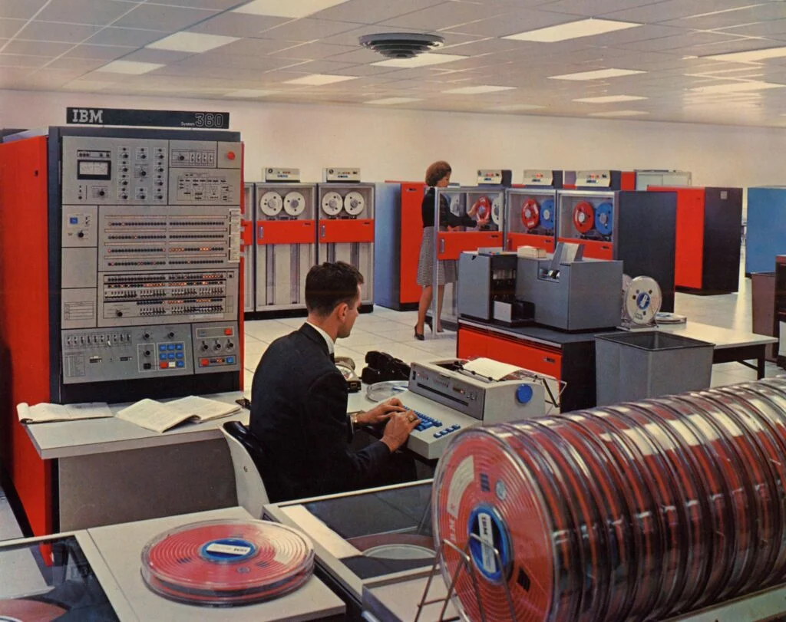

La virtualisation est une technologie transformative qui a révolutionné la façon dont nous concevons, déployons et gérons les infrastructures informatiques. En permettant l'abstraction des ressources matérielles et la création d'environnements virtuels multiples sur une seule plateforme physique, la virtualisation a ouvert la voie à une utilisation plus efficace et flexible des ressources informatiques.

Cette technologie a des implications profondes dans divers domaines de l'informatique, allant des centres de données aux ordinateurs personnels, en passant par le cloud computing et au-delà. Elle offre des avantages significatifs en termes de coûts, de performances, de sécurité et de gestion des ressources, tout en posant de nouveaux défis et en nécessitant de nouvelles compétences.

## Histoire

L'histoire de la virtualisation remonte aux années 1960, bien avant l'ère des ordinateurs personnels et du cloud computing.

En **1960**, IBM introduit le concept de virtualisation avec son système [CP-40](https://fr.wikipedia.org/wiki/IBM_CP-40) en 1964, suivi du CP-67 en 1966. Ces systèmes permettaient de partitionner les mainframes (ordinateurs capables de traiter des milliards de calculs et de transactions en temps réel, de manière sécurisée et fiable) en plusieurs machines virtuelles, chacune exécutant son propre système d'exploitation. L'objectif principal était d'optimiser l'utilisation leur coût en permettant le traitement simultané de plusieurs tâches.

En **1970-1980**, IBM continue à développer la technologie avec des systèmes comme [VM/370](https://en.wikipedia.org/wiki/IBM_System/370). D'autres fabricants de mainframes, comme DEC et HP, commencent à explorer la virtualisation. Cependant, avec l'avènement des mini-ordinateurs et des PC moins coûteux, l'intérêt pour la virtualisation diminue.

En **1990**, La croissance d'Internet et l'augmentation des besoins en puissance de calcul ravivent l'intérêt pour la virtualisation. En 1998, VMware est fondée et commence à travailler sur la virtualisation pour les plateformes x86.

Dans les années **2000**, VMware lance ses premiers produits de virtualisation pour serveurs x86, Xen, un hyperviseur open-source, est créé à l'Université de Cambridge en 2003, Amazon lance, en 2026, EC2 (Elastic Compute Cloud), marquant le début du cloud computing basé sur la virtualisation et en 2007, KVM (Kernel-based Virtual Machine) est intégré au noyau Linux.

Depuis les années 2010, la virtualisation devient omniprésente dans les centres de données avec :

* L'émergence de la conteneurisation avec Docker (2013) comme forme légère de virtualisation,
* Le développement de la virtualisation de réseaux (NFV) et du stockage défini par logiciel (SDS),
* l'intégration croissante avec l'intelligence artificielle et l'apprentissage automatique pour l'optimisation des ressources.

## L'Hyperviseur

L'hyperviseur est le composant logiciel central qui gère la virtualisation.

Il agit comme une couche d'abstraction entre le matériel physique et les machines virtuelles. Il gère et contrôle les ressources matérielles, les allouant aux différentes machines virtuelles selon leurs besoins. Il permet aussi d'isoler des machines virtuelles, de partager des ressources, migration à chaud, etc.

Il existe deux types d'hyperviseur :

* **Type 1** (bare-metal) : S'exécute directement sur le matériel,

  * Proxmox,
  * ESXi
  * Hyper-V
  * KVM
* **Type 2** (hosted) : S'exécute sur un système d'exploitation hôte.

  * VMware
  * Virtalbox
  * Hyper-V (Attention, ce dernier une fois installé ne permet plus d'utiliser les autres, car il agit comme un Hyperviseur de type 1. Merci Microsoft ;)).

## Conclusion

Bien que l'hyperviseur soit crucial, il existe d'autres technologies de virtualisation qui ne reposent pas nécessairement sur un hyperviseur traditionnel, comme la conteneurisation (Docker, par exemple).
