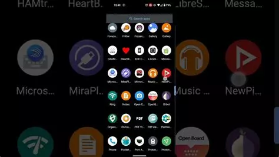

import Alert from "@components/mdx/Alert.astro";

Les smartphones sont devenus les compagnons indispensables de notre quotidien. Nous les utilisons pour communiquer, nous informer et nous divertir.

Ces appareils ont révolutionné notre façon de travailler, permettant de gérer e-mails, agenda, mais aussi nous servent de GPS, d'appareil photo, de lecteur de musique et même de portefeuille numérique. Ils ont aussi accès à notre santé, avec des applications de suivi d'activité physique et de bien-être.

Cependant, **leur omniprésence soulève des questions sur notre dépendance technologique et notre vie privée**. Leur contenu est souvent envoyé vers les clouds des GAFAM (Google, Amazon, Facebook, Apple, Microsoft) de manière automatique, leur donnant tous les droits sur vos fichiers. L'usage excessif peut affecter notre sommeil, notre concentration et nos relations sociales.

<Alert type="warning">Exemple chez Google "Par le biais de cette licence, vous autorisez Google à utiliser vos droits de propriété intellectuelle sur vos contenus (tels que les droits d'auteur et les marques enregistrées), ainsi que les droits immatériels que vous détenez sur vos contenus (tels que les droits à l'image)."</Alert>

Malgré ces défis, les smartphones continuent d'évoluer, intégrant l'IA, promettant de nouvelles manières d'interagir avec le monde qui nous entoure et de nouvelles utilisations de nos données les plus intimes.

Nous allons voir dans cet article quelles sont les solutions pour reprendre la main sur nos smartphones et les données qu'ils contiennent.

## L'OS ou ROM

Votre smartphone est composé d'un OS Android. Cet OS est installé par le fabricant de votre appareil en se basant sur la ROM Android mise à disposition par Google et en y ajoutant leurs applications, leurs drivers (s'ils y installent du matériel spécifique) et leurs pubs (coucou Xiaomi).

L'alternative la plus intéressante est de remplacer l'OS d'origine par une ROM personnalisée (dit custom). Une ROM custom est une version personnalisée du système d'exploitation Android. Elle remplace le logiciel d'origine installé par le fabricant du smartphone et offrent souvent des fonctionnalités supplémentaires, comme :

* Des mises à jour plus fréquentes, 
* Un maintien plus long dans le temps, 
* Les dernières versions d'Android sur des appareils plus anciens,
* Un meilleur contrôle sur le dispositif,
* Améliorer les performances, 
* Prolonger l'autonomie de la batterie,
* Ou simplement personnaliser davantage leur expérience Android

Cependant, ce n'est pas tout rose. L'installation d'une ROM personnalisée peut nécessiter des connaissances techniques et peut comporter des risques, comme la perte de garantie ou le "brick" potentiel de l'appareil si l'opération est mal effectuée.

**Rassurez-vous, le brick est assez rare.**

Parmi les ROMs populaires, on trouve LineageOS (anciennement CyanogenMod), Pixel Experience, et Resurrection Remix, mais même si elles respecteront plus la vie privée que celle des constructeurs, elles sont pour la plupart connectées aux serveurs de Google.

Certaines ROMs sont orientées vers le respecte de la vie privée comme [Lineage for MicroG](https://lineage.microg.org/), [CalyxOS](https://calyxos.org/), [/e/OS](https://e.foundation/e-os/), [GrapheneOS](https://grapheneos.org/) et [IodéOS](https://iode.tech/fr/iodeos/) (ma préférée). Elles sont dans la plupart basé sur [LineageOS](https://lineageos.org/) et débarrassées de tous les traqueurs Google.

Nous allons faire un rapide tour de ces ROMs orienté vie privée pour que vous ayez un aperçu, mais sans rentrer dans les détails.

### Les ROMs de base

La plupart des ROMs custom se basent sur un nombre restreint de ROMs dont voici les noms.

**LineageOS** (https://lineageos.org/) **:** C'est la ROM source la plus populaire et la plus utilisée. De nombreuses ROMs personnalisées sont basées sur LineageOS en raison de sa stabilité, de ses performances et de sa large compatibilité avec différents appareils.

**AOSP (Android Open Source Project)** (https://source.android.com/?hl=fr) **:** C'est la source originale d'Android publiée par Google. Beaucoup de développeurs commencent avec AOSP pour créer leurs propres ROMs.

**Resurrection Remix** (https://github.com/ResurrectionRemix) **:** Une ROM très personnalisable qui sert souvent de base à d'autres ROMs en raison de ses nombreuses fonctionnalités.

**CrDroid** (https://crdroid.net/) **:** Une ROM basée sur LineageOS qui ajoute de nombreuses fonctionnalités et personnalisations.

**Paranoid Android** (https://paranoidandroid.co/) **:** Connue pour ses innovations en matière d'interface utilisateur, elle sert parfois de base à d'autres ROMs.

**OmniROM** (https://omnirom.org/) **:** Une autre ROM populaire qui sert de base à certains projets.

Ces ROMs sont appréciées pour leur stabilité, leurs performances, et leur large support matériel. Les développeurs les utilisent généralement comme point de départ, en y ajoutant leurs propres modifications et fonctionnalités pour créer de nouvelles ROMs personnalisées.

Passons au sujet de cet article, les ROMs respectant la vie privée.

### Les ROMs orientées Vie Privée

Dans ma quête de ROMs orientées vie privée, j'en ai trouvé cinq (il y en a surement d'autres). Je vais essayer de vous les présenter succinctement. Je ne les ai pas toutes essayées, car il faut qu'elles proposent une version pour un smartphone que je détiens.

<Alert type="info">L'utilisation de ROMs respectueuses de la vie privée peut ajouter quelques contraintes. Par exemple, certaines applications bancaires ne pourraient plus marcher parce que votre téléphone peut être reconnu comme root. Dans certaines, c'est Android Auto qui ne marchera pas (même s'il est possible de le rajouter ultérieurement)</Alert>

On va commencer par celle que j'utilise et qui depuis ne m'a jamais déçue, [IodéOS](https://iode.tech/fr/iodeos/).

#### IodéOS

Je vais être un peu chauvin (Vincent un des dev est français), mais je vous avoue que depuis que je l'ai installé sur mon Xiaomi Mi 9, je ne l'ai jamais changé, même lorsque j'ai dû changer mon smartphone par un Google Pixel 6 reconditionné, j'ai orienté mon choix vers un téléphone supporté par IodéOS.

<Alert type="info">Dans le monde des ROMs custom, les smartphones Google Pixel sont souvent disponibles.</Alert>

[IodéOS](https://iode.tech/fr/iodeos/) est une ROM Android personnalisée qui se concentre sur la **confidentialité et la sécurité**. Son objectif principal est de fournir un système d'exploitation mobile qui **respecte la vie privée des utilisateurs** tout en offrant une expérience Android familière. Elle est basée sur LineageOS est complètement **dépourvue des services Google**, ce qui signifie qu'elle n'**envoie pas** de **données à Google** par **défaut**.

Elle propose des alternatives open-source aux services Google, comme **microG** pour la gestion des services de base, **F-Droid** comme magasin d'applications par défaut, mais **permet l'installation** des applications disponibles sur le **Play Store Officiel** **grâce** au magasin **Aurora Store**.

Le système offre des mises à jour OTA (Over-The-Air) régulières (souvent mensuelles) pour maintenir la sécurité et les performances.

IodéOS est disponible pour une variété d'appareils, mais elle n'est pas la plus étoffée. Pour voir les appareils supportés, rendez-vous ici ([Liste officielle](https://iode.tech/installation/), [Non officielle](https://community.iode.tech/t/editable-list-iodeos-official-unofficial-devices/1877)).

Afin de faciliter l'installation pour les débutants, IodéOS met à disposition un programme [d'installation "automatique"](https://gitlab.com/iode/ota/-/tree/master/installer) pour certains téléphones.

Le plus de cette ROM est son **bloqueur de pub**, développé par eux et pour IodéOS, qui intègre des outils pour mieux **contrôler les permissions des applications et limiter le suivi**.

iodéOS représente une option **intéressante** pour les utilisateurs soucieux de leur **vie privée** qui souhaitent une alternative à Android standard tout en conservant une **expérience** utilisateur **familière**. Elle accepte sans problème les applications bancaires et depuis peu Android Auto.

Les utilisateurs font évoluer une liste des applications compatibles avec IodéOS [ici](https://community.iode.tech/t/editable-list-apps-compatible-with-iodeos/808).

Il est possible d'acheter des téléphones neufs ou reconditionnés depuis [leur boutique](https://shop.iode.tech/fr/).

**Mon avis :**

Je trouve cette ROM superbe, elle est agréable. Il n'y a que le minimum d'applications préinstallées que vous pouvez désactiver simplement. Le bloqueur est de très bonne qualité et configurable, les mises à jour sont quasi mensuelles et la stabilité de la ROM est exemplaire. Il manque une plus grande compatibilité de téléphone, mais c'est en constante évolution.

#### /e/ OS

[/e/OS](https://e.foundation/e-os/) est la solution grand public [compatible avec le plus de smartphones](https://doc.e.foundation/devices) et se base principalement sur LineageOS, mais avec des modifications significatives. Elle bénéficie aussi d'un installateur compatible avec certains smartphones (voir la [liste ici](https://doc.e.foundation/easy-installer)).

Orientée vers la protection de la vie privée et développée par la e-Foundation, /e/OS retire tous les services Google de la ROM LineageOS et ajoute des outils supplémentaires pour protéger la vie privée des utilisateurs, comme un gestionnaire de localisation avancé.

Elle utilise son **propre magasin d'applications**, App Lounge, qui rend accessible des applications à partir du **Google Play Store** (applications commerciales), de **F-Droid** (applications open source) et également des **Progressive Web Apps** (PWA), le tout, en **un seul endroit**.  Elle propose un « **Privacy Score** » pour chaque application, calculé à partir du nombre de traqueurs trouvés par [Exodus Privacy](https://exodus-privacy.eu.org/fr/) dans chaque application et du nombre de permissions.

La ROM intègre ses propres **services cloud** pour remplacer ceux de Google sous le nom de [Murena Cloud](https://e.foundation/fr/ecloud/).

Ainsi, bien que /e/OS soit basée sur LineageOS, elle apporte des changements substantiels pour créer une expérience Android plus axée sur la protection de la vie privée.

Il est possible d'acheter des téléphones neufs ou reconditionnés depuis [leur boutique](https://murena.com/).

**Mon avis :**

L'interface fait un peu vieillissante (ok, c'est subjectif), il y a des applis préinstallées (je ne sais pas si elles sont maintenant désactivables simplement), pour les applis bancaires, la liste est [ici](https://community.e.foundation/t/list-banking-apps-on-e-os/33091). Le gros plus pour l'utilisateur lambda est son application tout-en-un qui permet de télécharger toutes les applications depuis une seule interface, mais elle induit à l'utilisateur l'impression d'installer des applications open source alors que ce n'est pas toujours le cas. Le cloud proposé permet de rivaliser avec le drive de Google, mais à une autre échelle, car forcément, il faudra passer à la caisse, mais retenez que rien n'est gratuit dans un monde respectueux.

#### CalyxOS

> Tout le monde a besoin d'un téléphone. Mais tout le monde n'a pas envie d'être espionné.

[CalyxOS](https://calyxos.org/) vise à offrir une expérience Android sécurisée et respectueuse de la vie privée, sans compromettre la facilité d'utilisation. Elle est construite sur AOSP (Android Open Source Project), avec des modifications importantes pour améliorer la sécurité. Elle intègre de nombreuses fonctionnalités de protection de la vie privée par défaut, limitant le suivi et la collecte de données. Elle inclut des améliorations de sécurité comme un système de mise à jour robuste et des options de chiffrement avancées.

CalyxOS intègre microG, une alternative open source aux services Google, permettant l'utilisation de certaines applications dépendantes de Google sans compromettre la confidentialité. Elle propose F-Droid pour les applications open source et Aurora Store pour accéder aux applications du Google Play Store.

CalyxOS est principalement disponible pour les téléphones Pixel de Google et quelques modèles d'autres marques.

L'équipe de CalyxOS fournit des mises à jour de sécurité rapides et régulières. Elle intègre des outils comme Seedvault pour la sauvegarde chiffrée, Datura Firewall pour un contrôle granulaire du réseau ainsi que le réseau Tor préinstallé.

CalyxOS est particulièrement appréciée par les utilisateurs recherchant un équilibre entre sécurité, confidentialité et fonctionnalité dans leur expérience Android.

**Mon avis :**

Je n'ai pas testé CalyxOS, donc je ne pourrais pas donner mon avis. Ce que je remarque est q'il y a des procédures complètes depuis Windows, MacOS ou Linux disponibles pour installer CalyxOS sur votre smartphone. La liste des applications préinstallées est disponible [ici](https://calyxos.org/docs/guide/apps/#included-apps), mais je ne sais pas si elles sont désactivables facilement. N'hésitez pas à me faire vos retours sur les réseaux sociaux, je serais curieux de votre avis.

#### Graphene OS

**[GrapheneOS](https://grapheneos.org/)** semble être l'une des ROMs Android les plus sécurisées et respectueuses de la vie privée disponibles, mais elle est seulement réservée pour les téléphones Pixel de chez Google ([liste ici](https://grapheneos.org/releases)).

Il est possible de l'[installer facilement depuis un navigateur](https://grapheneos.org/install/web).

GrapheneOS implémente de nombreuses améliorations de sécurité au-delà d'AOSP, comme un renforcement du sandbox, une meilleure randomisation de la mémoire et des protections contre les exploits. Aucun service Google n'est préinstallé, et le système est conçu pour minimiser la fuite de données. L'équipe derrière GrapheneOS est très réactive et fournit des mises à jour de sécurité rapides.

Malgré l'absence de services Google, de nombreuses applications fonctionnent grâce à la compatibilité Sandboxed Google Play comme Android Auto qui peut fonctionner avec un niveau de privilèges réduit.

**Mon avis :**

Je ne l'ai jamais testé non plus, alors il m'est difficile de vous donner mon avis. Il semble quand même plus orienté pour les utilisateurs techniques. Si vous êtes à la recherche d'une sécurité la plus poussée, alors c'est vers cet OS que vous devriez vous tourner.

#### Autres OS

Il existe d'autres ROMs comme évoqué plus haut ([AOKP](http://aokp.co/), [SlimRoms](https://slimroms.org/), [Paranoid](https://paranoidandroid.co/), [OmniRom](https://omnirom.org/), [Havoc-OS](https://havoc-os.com/), etc), pour la grande majorité des smartphones grand public (majoritairement équipés de puce Qualcomm). 

Une des plus grande communauté en ligne est [XDA](https://www.xda-developers.com/). Elle est bien connue des développeurs, passionnés de technologie et utilisateurs avancés d'appareils mobiles et est dédiée au développement et à la personnalisation des smartphones et tablettes, particulièrement sous Android. XDA est considéré comme une ressource précieuse pour ceux qui souhaitent optimiser leurs appareils au-delà des paramètres d'usine.

Le site a été fondé en 2002, initialement centré sur les assistants personnels Windows Mobile (PDA) d'où le nom XDA qui signifie "O2 XDA", un des premiers smartphones Windows Mobile. Bien qu'ayant commencé avec Windows Mobile, XDA s'est principalement concentré sur Android au fil des années, suivant l'évolution du marché mobile.

La communauté XDA est composée d'un blog avec des actualités sur les appareils mobiles, des tutoriels et guides, mais aussi des applications et mods ainsi qu'un forum de discussion.

C'est une source indispensable pour trouver les applications nécessaires au changement de ROM de votre smartphone.

## Conclusion

J'espère vous avoir donné des clés pour un smartphone plus respectueux de votre vie privée. Le passage d'une ROM constructeur à une ROM respectueuse de la vie privée n'est pas sans conséquences et peut rebuter certains.

Pour prendre plaisir à cette transition, je vous conseille d'y aller petit à petit afin de ne pas vous dégouter en ajoutant trop de difficultés d'un coup. Commencer par essayer de remplacer vos applications propriétaires par des applications open source, puis une fois que vous avez remplacé la plupart de ces applications, vous pouvez passer au changement d'OS.

Ça fait plus de trois ans que j'utilise IodéOS et plusieurs années sous différentes ROMs custom (principalement LineageOS). Depuis le passage à IodéOS, je n'ai plus changé d'OS. 

Chaque utilisation étant propre à chacun, il vous convient de tester les différentes solutions puis de sélectionner celle qui vous convient le mieux.

Bonne bidouille !!!

## Sources

* https://iode.tech/fr/iodeos/
* https://e.foundation/e-os/
* https://grapheneos.org/
* https://calyxos.org/
* https://lineage.microg.org/
* https://lineageos.org/
* https://fossdroid.com/
* https://aurorastore.org/
* https://f-droid.org/
* https://exodus-privacy.eu.org/fr/
