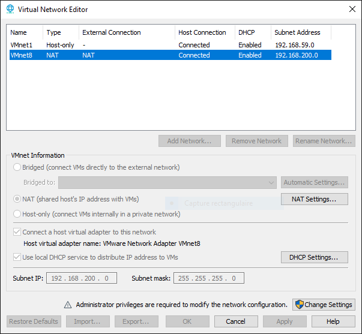
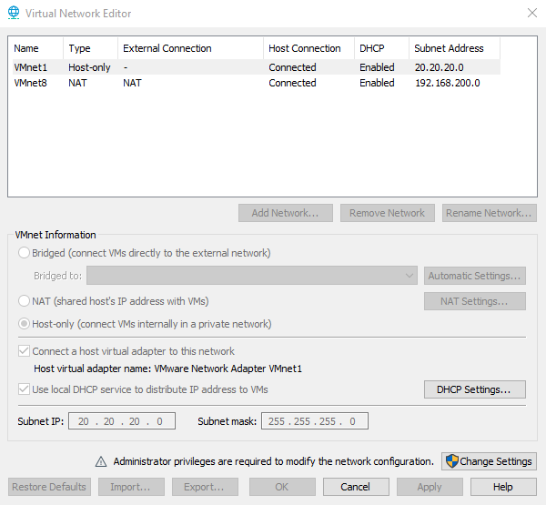
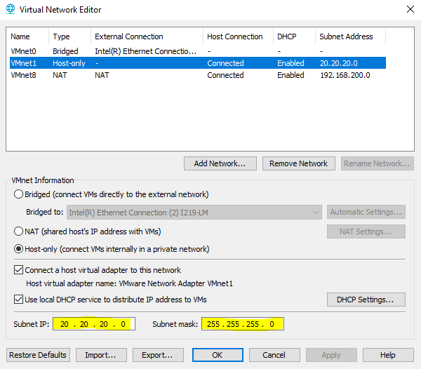

import Alert from "@components/mdx/Alert.astro";

Dans l'article [Installation de Windows Server avec VMware](/blog/vmware_windows_server_2019/), nous avons connecté notre Windows Server sur la NAT, mais qu'est-ce que c'est et quels sont les différents réseaux présents et/ou configurable dans VMware.

Le but de cet article est d'approfondir ces notions depuis VMware, mais qui seront aussi valables sur VirtualBox ou autres logiciels de virtualisation.

<Alert type="info"> Ceci est un article rapide, je lui ajouterais des images, pour augmenter la compréhension, une fois que j'aurais trouvé les bonnes </Alert>

## Les types de Réseaux

Dans VMware, il existe plusieurs types de réseaux que vous pouvez configurer. Voici les principaux :

* Bridge
* NAT
* Host-Only
* Custom
* LAN-segment
* Interne

### Réseau bridgé (Bridge)

La machine virtuelle est connectée directement au réseau physique. Elle obtient une adresse IP du même réseau que la machine hôte.

Votre VM est visible par n'importe qu'elle machine de votre réseau.

### NAT (Network Address Translation) :

La VM utilise l'adresse IP de l'hôte pour communiquer avec l'extérieur. C'est complètement transparent pour vous. La machine hôte fait office de routeur pour la VM.

Permet d'accéder à Internet depuis la VM sans configuration réseau supplémentaire.

### Réseau privé hôte (Host-only)

Cette configuration créée un réseau isolé entre la machine hôte et les VMs. Elles peuvent communiquer entre elles et avec la machine hôte, mais pas avec l'extérieur.

Ça permet de tester des configurations de réseaux isolés.

#### Configurer sont Host-Only

Pour configurer une machine avec Host Only, il faut verifier l'IP et le masque utilisé par VMware. Pour cela :

1. Dans VMware, cliquez sur `Edit -> Virtual Network Editor...`
2. Vérifiez le `Subnet Address` de l'interface `VMnet1` (Host-only) (ici 20.20.20.0)

   
3. Si vous souhaitez modifier le sous-réseau, il vous suffit de cliquer sur `Change Settings` en bas de la fenêtre,

   
4. Appliquez avec `Apply` puis `OK`,
5. Configurez vos serveurs avec une IP statique avec [ce court tutoriel](/short/debian_ip_statique_cli/).
6. Pour tester depuis votre machine hôte, lancer un ping sur l'adresse IP de votre VM (machine invitée).

### Réseau personnalisé (Custom)

Cette configuration permet de créer des configurations réseau avancées pour simuler des topologies réseau complexes.

### LAN segment

Permet de connecter des VMs entre elles sans passer par un switch virtuel. Utile pour isoler un groupe de VMs. C'est cette configuration que nous utiliserons pour simuler un parc informatique complet.

### Réseau interne

Similaire au réseau **host-only**, mais sans connexion à l'hôte. Les VMs peuvent communiquer entre elles, mais sont entièrement isolées de l'hôte et de l'extérieur. À vous de configurer les adresses IP de vos VMs de manière statique.

## Conclusion

Il est intéressant de créer vos VMs en mode NAT pour les connecter à internet et bénéficier des mises à jour. Ensuite, il vous suffit de créer un LAN-Segment pour simuler votre propre réseau en y ajoutant vos VMs clientes, serveurs, routeurs ou autres.
