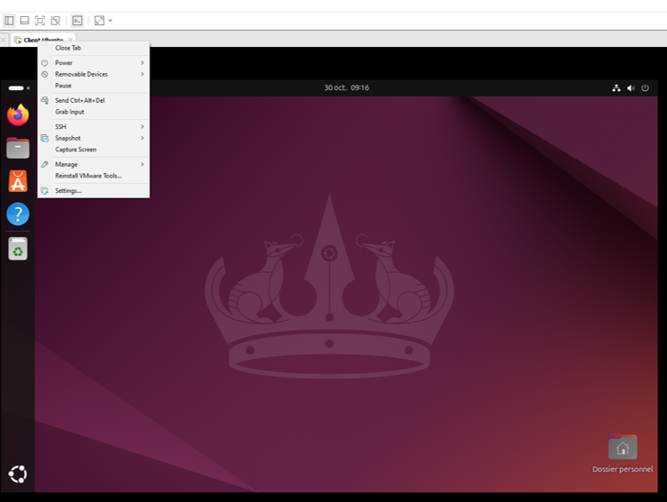
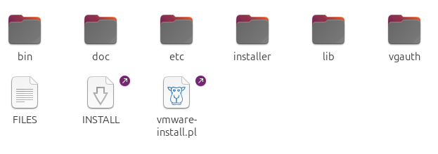

import Alert from "@components/mdx/Alert.astro";

Salut à tous,

Un petit article rapide sur l'installation de VMware Tools spécial **débutant**.

**Qu'est-ce que VMware Tools ?**

VMware Tools est un ensemble de pilotes et d'utilitaires qui améliore les performances et la gestion des machines virtuelles (VM) créées avec VMware. Une fois installés, ils optimisent les interactions entre l’hôte et les VM, notamment en facilitant le partage de fichiers, en améliorant la gestion des périphériques et en permettant des fonctionnalités comme le redimensionnement de l’écran ou la synchronisation de l'horloge système. VMware Tools est essentiel pour une expérience utilisateur fluide et pour tirer le meilleur parti de la virtualisation VMware.

J'utilise une distribution Ubuntu 24 pour le tutoriel, mais cela devrait marcher sur la plupart des distributions Linux basé sur Debian.

## Installation sur Ubuntu

Je pars du principe que vous avez une VM Ubuntu démarrée. Ensuite :

1. Clic-droit sur l'onglet de votre VM puis sélectionner `Install VMware Tools`.

Un CD devrait se monter sur votre VM Ubuntu. Ouvrez-le.

1. Copier-coller le dossier compressé `VMwareTools-xxxxxxxxxx.tar.gz` sur votre Bureau (ou autres dossiers de votre machine).
2. Décompressez-le et rendez-vous à l'intérieur.

1. Lancer un Terminal (*clic-droit -> Ouvrir un Terminal*) et lancer la commande suivante `sudo ./vmware-install.pl`.
2. Il va ensuite vous poser plusieurs questions sur les modules à installer que vous pouvez valider par <kbd>Entrée</kbd> pour qu'il prenne les valeurs par défaut.

<Alert type="info">Je ne vais pas vous mettre le retour de la commande, car il est très long !!</Alert>

Et voilà, c'est fait, il ne vous reste plus qu'à profiter des avantages de VMware Tools sur votre machine.

C'est court comme article, mais ça peut toujours servir pour les débutants.

À la prochaine rédaction !!!
