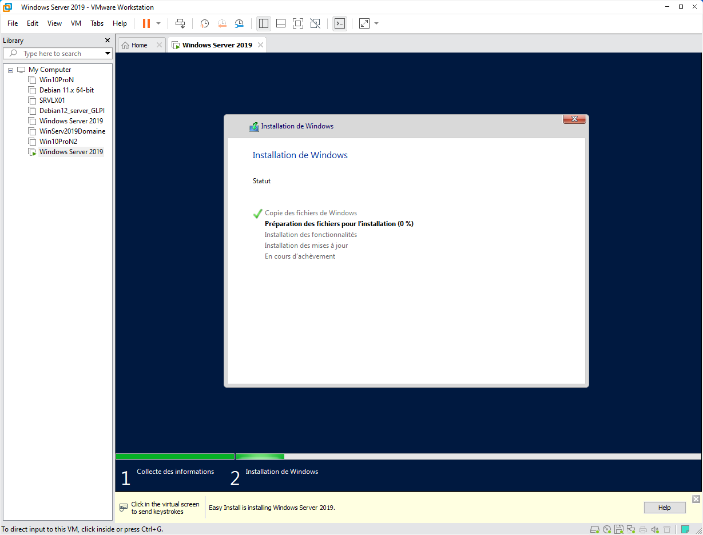

import Alert from "@components/mdx/Alert.astro";

L'utilisation de machines virtuelles est devenue incontournable dans le monde informatique moderne, offrant flexibilité, économies et facilité de gestion. Parmi les solutions les plus populaires, on trouve VMware, un leader dans le domaine de la virtualisation.

Quand on parle de serveur en entreprise, on parle souvent de Windows Server, le système d'exploitation serveur de Microsoft

Un des atouts majeurs de Windows Server est son Active Directory (AD), le service d'annuaire de Microsoft. Active Directory joue un rôle crucial dans la gestion centralisée des identités, des accès et des politiques au sein d'un réseau d'entreprise. 

L'installation d'une VM Windows Server sur VMware offre une plateforme idéale pour tester, déployer et gérer Active Directory, permettant aux administrateurs en herbes de créer un environnement de test ou de mettre en place une infrastructure complète de gestion d'identités.

Cet article vous guidera à travers le processus d'installation d'une machine virtuelle Windows Server sur VMware.

## Installation

Nous allons installer Windows Server avec VMware. Pour cela :

1. Créez une nouvelle machine virtuelle soit via le bouton `Create a New Virtual Machine` dans l'onglet Home ou Clic-droit puis `New Virtual Machine...` dans la Library ou bien dans `File->New Virtual Machine...`,

   
2. Choisir la configuration `Custom (advanced)`,

   
3. On vous demande de choisir la compatibilité Hardware, laissez Workstation 17.x,

   
4. Sélectionnez votre image de Windows Server 2019,

   
5. Saisir une clé de licence, sélectionnez la version Windows Server 2019 ou 2022 Standard, puis le nom de la machine et un mot de passe,
  <Alert type="info">Vous pouvez récuperer une licence de test depuis le [site de Microsoft](https://learn.microsoft.com/fr-fr/windows-server/get-started/kms-client-activation-keys?tabs=server2019%2Cwindows10ltsc%2Cversion1803%2Cwindows81#windows-server-ltsc)</Alert>

  <Alert type="info">Il existe deux versions de Windows Server, une verison **Core** qui installe une version en PowerShell de Windows Server (sans UI) et une **classique avec une interface graphique,** nous utiliserons cette derniere.</Alert>

6. Donnez un nom à votre VM et saisir le dossier de destination,

   
7. Sélectionnez le type de Bios que vous voulez,

   
8. Allouez-lui un nombre de cœurs, une quantité de RAM, sélectionnez Use network address translation (NAT), SCI, NVMe.

   
9. Créez un nouveau disque virtuel avec `Create a new virtual disk`, sélectionnez une taille pour ce dernier et sélectionnez `Store virtual disk as a single` file et finissez par lui donner un nom

   
10. Vérifiez les paramètres, puis cliquez sur `Finish` pour lancer l'installation.

    

    Une fois l'initialisation de la VLM réussie, elle va se lancer et installer Windows Server de façon autonome.

L'installation de Windows Server est terminé et VMware a installé VMware Tool permettant quelques manipulations entre les VMs et l'hôte. Il vous reste à effectuer les mises à jour de votre Windows Server (possible, car nous sommes en NAT).

## Préparons le futur
Pour nos prochains articles sur Windows Server, nous allons travailler dans un réseau isolé. Pour cela, nous allons passer notre serveur sur un LAN Segment (je vous laisse regarder l'[article sur les réseaux avec VMware](/blog/vmware_gestion_reseaux/)).

D'autres articles viendrons comme l'installation de l'Active Directory et l'ajout d'un serveur DNS.

