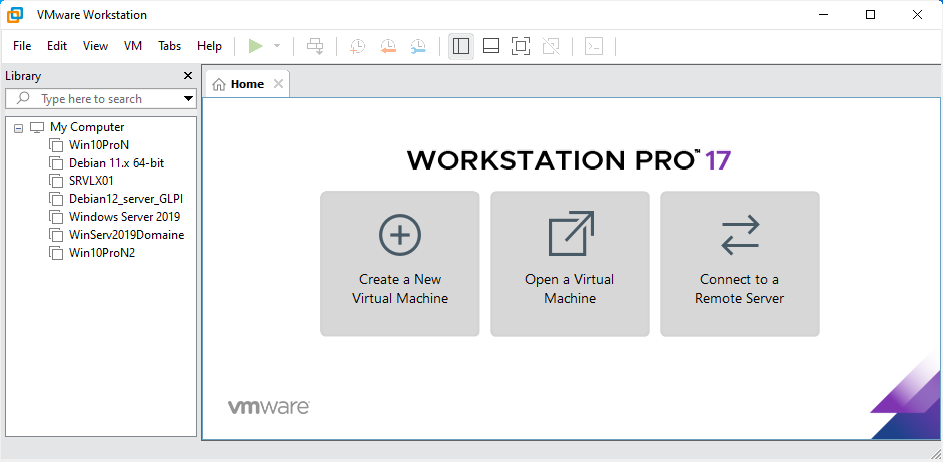

blablblable

## Installation

Nous allons installer Windows Server avec VMware. Pour cela :

1. Créez une nouvelle machine virtuelle soit via le bouton `Create a New Virtual Machine` dans l'onglet Home ou Clic-droit puis `New Virtual Machine...` dans la Library ou bien dans `File->New Virtual Machine...`,

   
2. Choisir la configuration `Custom (advanced)`,

   
3. On vous demande de choisir la compatibilité Hardware, laissez Workstation 17.x,

   
4. Sélectionnez votre image de Windows Server 2019,

   
5. Saisir une clé de licence, sélectionnez la version Windows Server 2019 Standard, puis le nom de la machine et un mot de passe,
6. Donnez un nom à votre VM et saisir le dossier de destination,
7. Selectionnez le type de Bios que vous voulez,
8. Allouez lui un nombre de coeurs, une quantité de RAM, selectionnez Use network address translation (NAT), SCI, NVMe.
9. Créez un nouveau disque virtuel avec Create a new virtual disk, selectionnez une taille pour ce dernier et serlectionnez Store virtual disk as a single file et finissez par lui donner un nom
10. Cliquez sur Finish pour lancer l'installation.
