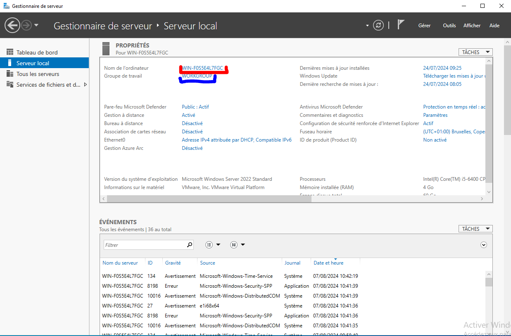
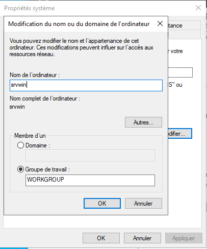
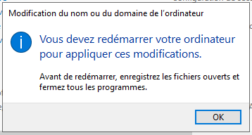
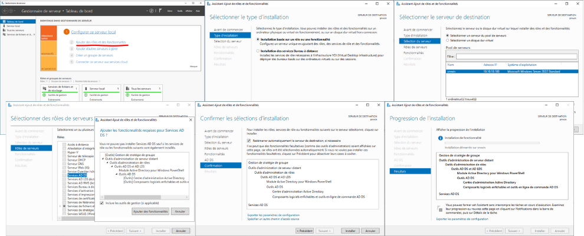
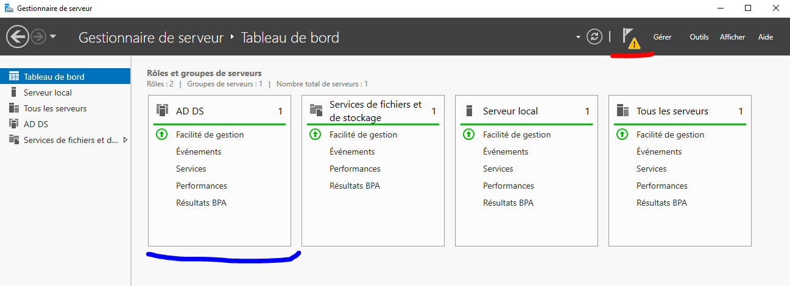
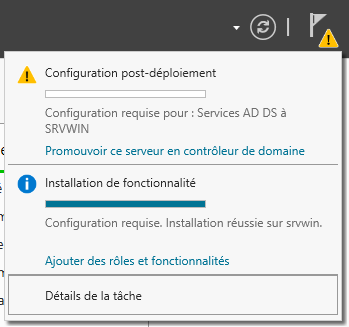
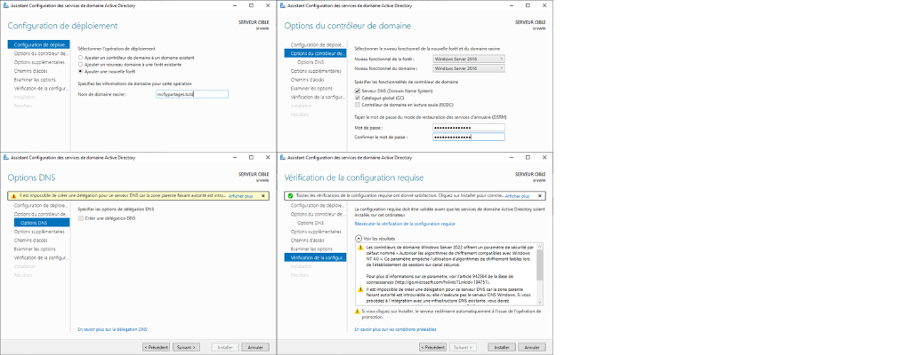

Comme dit dans l'article précédent sur l'installation de Windows Server, je ne suis pas un grand fan des outils des GAFAM, mais Microsoft avec Windows Server a su réunir et faciliter la gestion d'un parc informatique pour une entreprise ou une organisation via l'utilisation d'un **Domaine Active Directory**.

Voici les **principaux avantages** de travailler en **domaine** avec Windows :

* *Gestion centralisée :* Permet d'administrer facilement un grand nombre d'ordinateurs depuis un point central.
* *Sécurité renforcée :* Politiques de groupe, authentification centralisée, contrôle d'accès plus fin.
* *Partage de ressources simplifié :* Fichiers, imprimantes et autres ressources partagées plus simplement.
* *Profils itinérants :* Les utilisateurs retrouvent leur environnement sur n'importe quel poste du domaine.
* *Mises à jour centralisées :* Déploiement de mises à jour et de logiciels plus efficace.
* *Sauvegarde facilitée :* Politiques de sauvegarde centralisées pour tous les postes.
* *Support technique amélioré :* Prise en main à distance et résolution de problèmes facilitées.

Je ne vais pas vous expliquer ce qu'est un Active Directory ici, car je découvre seulement tout ça et il y a de très bons tutos et très complet sur [IT-Connect](https://www.it-connect.fr/cours/notions-de-base-de-lactive-directory/) ou sur YouTube avec les vidéos d['IT-Connect](https://www.youtube.com/watch?v=fzZzpLD9EJM&list=PLSuzYIVSEUT4VSB0m0NdiML2V0PDWQyAN), [Cookie Connecté](https://www.youtube.com/watch?v=nhW-0qZzjy4) ou [FormIP](https://www.youtube.com/watch?v=AOv9wBPsu2s).

Nous allons commencer par ajouter le rôle Domaine AD, donner un nom plus parlant à notre serveur et ajouter le domaine à notre serveur. 

Actuellement le **nom** de notre machine est `WIN-F0S5E4L7FGC` avec le **groupe de travail** `WORKGROUP`.

## Ajouter un Domaine

Comme je l'ai dit plus haut, nous allons d'abord changer le nom de notre serveur.

### Changer le nom du serveur

Pour changer le nom de notre serveur, depuis le Gestionnaire de serveur, vous devez :

1. Cliquez sur le Nom de l'ordinateur,
2. Cliquez sur le bouton `Modifier...`,
3. Saisir le nom de l'ordinateur que vous souhaitez (ici `srvwin`),

4. Validez puis redémarrez.

Votre Windows Server redémarré, nous allons passer à la création d'un domaine Active Directory.

### Ajouter le rôle AD DS (Active Directory Domain Service)

> Connectez-vous avec le compte Administrateur de Windows Server et le compte créé lors de l'installation

Dans le Gestionnaire de serveur, cliquez sur le `2 Ajouter des rôles et des fonctionnalités`, puis :

1. La première page est une explication, cliquez sur le bouton `Suivant`,
2. Choisir `Installation basée sur un rôle ou une fonctionnalité`, puis suivant,
3. Choisir `Sélectionnez un serveur du pool de serveurs`, puis suivant,
4. Dans la fenêtre suivante, sélectionnez `AD DS`, cliquez sur `Ajouter des fonctionnalités` depuis la nouvelle fenêtre qui s'affiche, puis sur suivant,
5. Dans la fenêtre Sélectionner des fonctionnalités, cliquez sur suivant et faites de même pour la fenêtre suivante,
6. Dans la fenêtre Confirmer les sélections d'installation, vous pouvez cocher la case `Redémarrer automatiquement le serveur de destination, si nécessaire` (on n'est pas sur une installation sensible) puis sur le bouton  `Installer`.

Une fois l'installation terminée, vous devez avoir un nouveau rôle dans le Gestionnaire de serveur et un petit triangle orange en haut à droite du Gestionnaire de serveur.

Ce Triangle orange nous indique qu'il y a une configuration nécessaire (suite à l'installation de AD DS).

Cliquez sur `Promouvoir ce serveur en contrôleur de domaine`, une fenêtre s'ouvre nous permettant de configurer le rôle AD DS.

1. Sélectionnez `Ajouter une nouvelle forêt`,
2. Saisir le nom de votre domaine racine (ici mcflypartages.tuto)
3. Dans la fenêtre suivante, laissez Windows Server 2016 (pour notre utilisation), laissez cocher `Serveur DNS` et saisissez un mot de passe de restauration.

> Ce choix doit se faire en fonction des versions de Windows Server que vous avez dans votre domaine en s'adaptant a la version la plus basse disponnible dans votre domaine. Nous avons une seule installation de Windows Server (celle-ci) qui est en 2022 ou 2019.

1. La fenêtre suivante vous affiche une erreur de DNS, mais c'est normale, cliquez sur `Suivant`,
2. Donnez un nom NetBIOS (un nom court, ici MFP), puis Suivant,
3. Laissez les fenêtres suivantes par défaut jusqu'à la `Vérification de la configuration requise`,
4. Il y a quelques Warnings, mais vous pouvez passer à l'installation.

> ATTENTION : Nous ne l'avons pas vu, mais par défaut, le compte Administrateur de Windows Server n'a pas de mot de passe (la sécurité sous Windows ;)). Si vous n'avez pas défini de mot de passe pour ce dernier, il vous refusera la configuration d'AD DS et donc son installation.

Pendant l'installation, il va vous déconnecter puis procéder à l'installation de l'AD.

Reconnectez-vous et vous devriez avoir votre serveur directement configuré dans votre domaine (vérifiez-le dans le Serveur local depuis le Gestionnaire de serveur).

## Conclusion

Nous venons de voir comment changer le nom de notre serveur Windows Server et comment créer et ajouter un Domaine Active Directory.

Mes articles sur le sujet sont plus des notes personnelles, plutôt que des vrais tutoriels professionnels, je ne peux que vous encourager à suivre les articles de IT-Connect, Coockie Connectée ou FormIP qui sont plus légitimes que moi dans le domaine.

À bientôt pour d'autres notes sur Windows Server.
