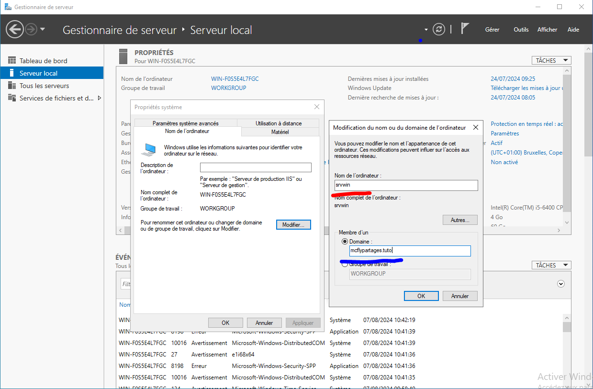

Comme dit dans l'article précédent sur l'installation de Windows Server, je ne suis pas un grand fan des outils des GAFAM, mais Microsoft avec Windows Server a su réunir et faciliter la gestion d'un parc informatique pour une entreprise ou une organisation via l'utilisation d'un **Domaine**.

Voici les **principaux avantages** de travailler en **domaine** avec Windows :

* *Gestion centralisée :* Permet d'administrer facilement un grand nombre d'ordinateurs depuis un point central.
* *Sécurité renforcée :* Politiques de groupe, authentification centralisée, contrôle d'accès plus fin.
* *Partage de ressources simplifié :* Fichiers, imprimantes et autres ressources partagées plus simplement.
* *Profils itinérants :* Les utilisateurs retrouvent leur environnement sur n'importe quel poste du domaine.
* *Mises à jour centralisées :* Déploiement de mises à jour et de logiciels plus efficace.
* *Sauvegarde facilitée :* Politiques de sauvegarde centralisées pour tous les postes.
* *Support technique amélioré :* Prise en main à distance et résolution de problèmes facilitées.

Nous allons commencer par donner un nom plus parlant à notre serveur et créer un domaine pour ce dernier. 

Actuellement le **nom** de notre machine est `WIN-F0S5E4L7FGC` avec le **groupe de travail** `WORKGROUP`.

## Ajouter un Domaine

Comme je l'ai dit plus haut, nous allons d'abord changer le nom de notre serveur.

### Changer le nom du serveur

Pour changer le nom de notre serveur, depuis le Gestionnaire de serveur, vous devez :

1. Cliquez sur le Nom de l'ordinateur,
2. Cliquez sur le bouton `Modifier...`,
3. Saisir le nom de l'ordinateur que vous souhaitez (ici `srvwin`),
4. Sélectionnez Domaine et saisir le domaine que vous souhaitez utiliser (ici `mcflypartages.tuto`)

   
5. Validez avec le bouton OK
