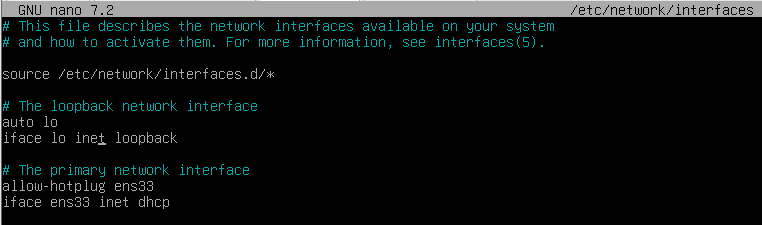

import Alert from "@components/mdx/Alert.astro";

Pour configurer une adresse IP statique sur Debian 12, (marche aussi sous Proxmox), il va falloir éditer le fichier `interfaces` dans `/etc/network/` avec la commande `nano /etc/network/interfaces` avec les droits `root` bien sûr. (`su -`).
Voilà le fichier d'origine :



Ensuite, il va falloir remplacer la dernière ligne par `static` à la place de `dhcp` et ajouter les informations d'adresse, de masque réseau et de passerelle comme l'exemple ci-dessous.

```shell
iface ens33 inet static
address xxx.xxx.xxx.xxx
netmask 255.255.255.0
gateway xxx.xxx.xxx.xxx
```

Ou avec le CIDR

```shell
iface ens33 inet static
address xxx.xxx.xxx.xxx/xx
gateway xxx.xxx.xxx.xxx
```


<Alert type="info">Bien entendu, c'est à vous de saisir les IPs que vous souhaitez et ajouter une Passerelle (Gateway) si nécessaire.</Alert>

Validez vos changements avec`CTRL + X` et relancez avec `systemctl restart networking` ou `systemctl restart NetworkManager` et vérifiez avec la commande suivante `ip addr show <interface_name>`.

Voilà le rapide tuto pour changer l'adresse IP de votre serveur Debian ou Proxmox. Il se peut que pour ce dernier, un redémarrage soit nécessaire.
