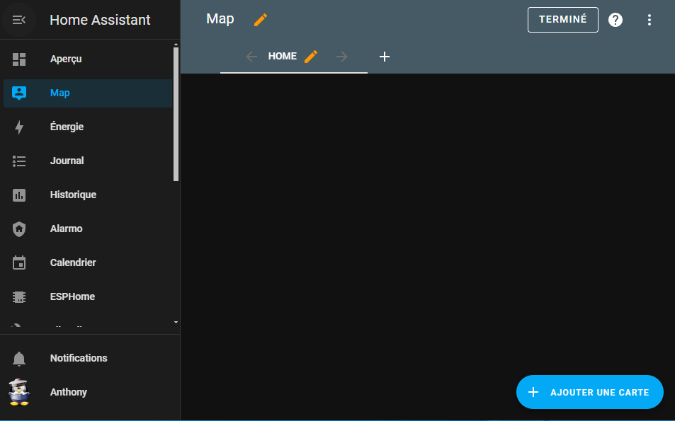
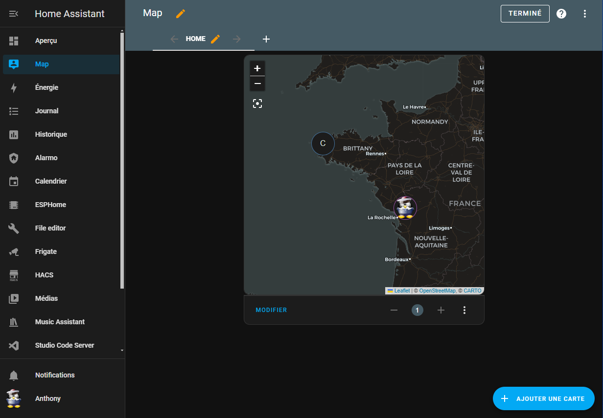
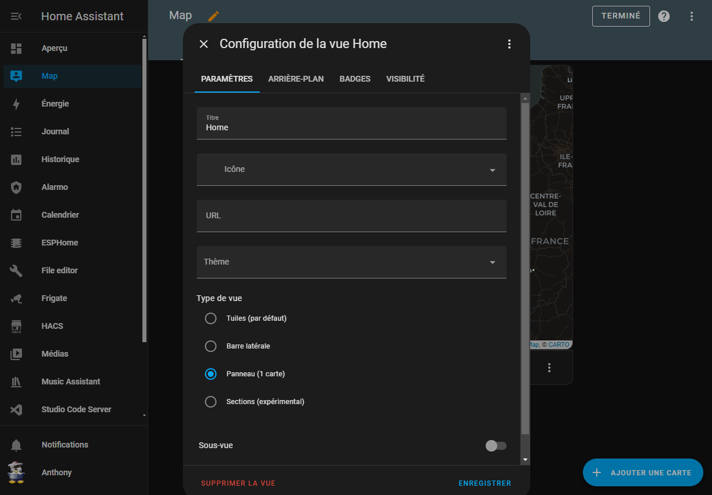
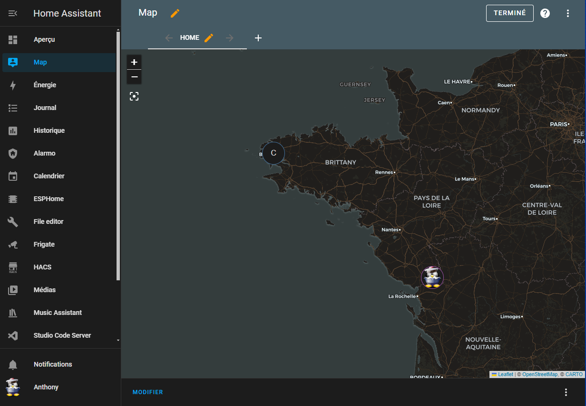

J'ai par erreur effacé la vue carte en voulant bidouiller mon Home Assistant. Je vais donc vous montrer rapidement comment la remettre.

Normalement, depuis le menu \`Map\` si vous essayez d'éditer cette vue, il vous demandera de confirmer que vous souhaitez prendre la main. En acceptant, votre carte va disparaitre et votre \`Dashboard\` Map va devenir vide.

Voici la configuration dans laquelle j'étais.

Pour retrouver votre carte, il y a deux méthodes.

La première vous permet de retrouver la carte en quelques clics, la deuxième vous permet de mettre n'importe quelle carte en plein écran.

### Remettre votre carte Map comme a l'origine.

C'est la méthode la plus simple.

1. Allez dans `Paramètres -> Tableaux de bord`,
2. Cliquez sur `AJOUTER UN TABLEAU DE BORD` puis `Carte`,
3. Donnez-lui un Titre, une icône,
4. Activez `Afficher dans la barre latérale`.

### Ajouter n'importe quelle carte en plein écran.

1. Cliquez sur `AJOUTER UNE CARTE`,
2. Sélectionnez la carte `Carte`,
3. Dans `Entités`, sélectionnez les entités que vous souhaitez voir afficher,
4. Puis `ENREGISTRER`.

Vous devriez avoir ceci :

Ce n'est pas ce que nous voulons, car nous souhaitons que la tuile prenne toute la page (Dashboard).

Pour cela, vous devez :

1. Éditez votre vue en cliquant sur le crayon jaune dans l'onglet `HOME`,
2. Puis sélectionnez `Panneau` dans `Type de vue`.
3. `ENREGISTRER` et vous voila avec votre carte en plein écran.

Voici le résultat final.

Il vous reste à appuyer sur TERMINE et c'est bon.

Vous venez de retrouver votre carte map soit par la méthode simple ou la méthode permettant de passer n'importe qu'elle carte Home Assistant en plein écran.
