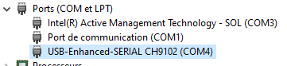

J'ai été confronté a un problème avec mon dongle Zigbee Sonoff modele E. Impossible de l'ajouter a Home Assistant, ni même de la flasher via [Silabs Firmware Builder](https://darkxst.github.io/silabs-firmware-builder/). Il a donc fallu utiliser l'ancienne méthode via Windows car je n'avais que ca sous la main mais ca doit être faisable sur Linux.


Il faut vérifier que votre périphérique apparait bien dans le Gestionnaire de périphérique, sinon, installez le driver disponible sur le site de [Silicon Labs](https://www.silabs.com/developer-tools/usb-to-uart-bridge-vcp-drivers?tab=downloads) en sélectionnant bien le driver VCP. 





Ensuite, vous récupérez le logiciel SecureCRT sur le[ site officiel](https://www.vandyke.com/cgi-bin/releases.php?product=securecrt). 

Ensuite :

1. Démonter votre Dongle USB (quatre vis),
2. Lancer SecureCRT,
3. Brancher votre Dongle au PC,
4. Dans SecureCRT, selectionnez "serial", port COMX de votre Dongle USB et Baud Rate 115200. Finir par "Connect".
5. Maintenir le bouton "boot" appuyer et appuyer sur le bouton "reset", puis relâcher les deux. Vous devriez voir apparaitre ceci a l'écran

   ```

   Sonoff v1.0.1

   Gecko Bootloader v1.12.00
   1. upload gbl
   2. run
   3. ebl info
   BL > 
   ```
6.

Sélectionnez Serial, puis votre port COM (le mien c'était COM3 par exemple, vVoici rapidement la procedure sans images (désolé)


ous pouvez le voir dans le Gestionnaire de périphérique), Speed/Baudrate à 115200 si on doit le renseigner sur le logiciel, le reste on laisse.
Sur votre Dongle-E branché, attention bien suivre, schéma en dessous si besoin :
Maintenir le bouton Boot
Puis cliquez sur le bouton Reset à côté
En ayant cliquez sur ce bouton Reset, relâchez le tout
Vous devriez voir sur la console marqué Gecko Bootloader
Si ça ne fonctionne pas, réessayez plusieurs fois en variant quand vous relâchez
Appuyez ensuite sur la touche 1 de votre clavier pour entrer en mode Upload (vous devriez voir des petits "cccc" apparaître).
Allez sur File Transfer ➡️ Xmodem ➡️ Send File, sélectionnez le fichier gbl précédemment téléchargé.
Attendez que ça flash puis fermez la session, c'est fini !
