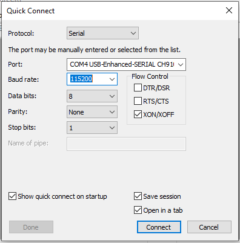

J'ai été confronté à un problème avec mon dongle Zigbee Sonoff modele E. Impossible de l'ajouter à Home Assistant, n'y même de la flasher via [Silabs Firmware Builder](<>). Il a donc fallu utiliser l'ancienne méthode via Windows, car je n'avais que ça sous la main, mais ça doit être faisable sur Linux.


Il faut vérifier que votre périphérique apparait bien dans le Gestionnaire de périphérique, sinon, installez le driver disponible sur le site de [Silicon Labs](<>). 


Ensuite, vous récupérez le logiciel SecureCRT sur le[ site officiel](https://www.vandyke.com/cgi-bin/releases.php?product=securecrt) et le dernier firmware de votre dongle sur le [GitHub de darkxst](https://github.com/darkxst/silabs-firmware-builder/tree/main/firmware_builds/zbdonglee).

Ensuite :

1. Démonter votre dongle USB (quatre vis),
2. Lancer SecureCRT,
3. Brancher votre dongle au PC,
4. Dans SecureCRT, sélectionnez "serial", port COMX de votre dongle USB et Baud Rate 115200. Finir par "Connect".

   
5. Maintenir le bouton "boot" appuyer et appuyer sur le bouton "reset", puis relâcher les deux. Vous devriez voir apparaitre ceci à l'écran

   ```

   Sonoff v1.0.1

   Gecko Bootloader v1.12.00
   1. upload gbl
   2. run
   3. ebl info
   BL > 
   ```
6. Saisir "`1`" puis dans le menu, sélectionner "`Transfer -> sendXmodem...`" et sélectionner votre fichier `.gbl`.


Une fois le flash terminé, il vous suffit de quitter la session.


Rapide et efficace, ma clé est de nouveau disponible au flash via le Silabs Firmware Builder.
