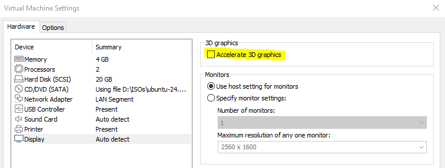
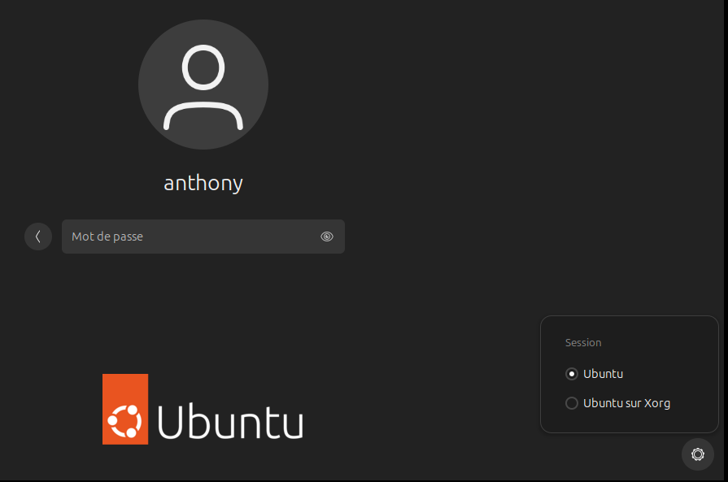

Salut à tous,

Un petit retour d'expérience sur l'installation d'Ubuntu 24 dans une VM à l'aide de VMware qui freeze lors de la connexion au dashboard.

Par contre l'installation, elle se passe sans problème.

Le problème vient d'un driver graphique. Pour résoudre ce dernier, il faut :

1. Vérifier que `Accelerate 3D graphics` soit désactivé dans les `Settings` de votre VM.

2. Sur l'écran de connexion, cliquer sur votre utilisateur **MAIS** ne mettez pas le mot de passe de suite.
3. Cliquer sur l'engrenage en bas à droite puis sélectionner **Ubuntu sur Xorg**.

4. Saisir votre mot de passe afin de vous connecter.

Deux solutions s'offrent à vous :

* Installer les VMware Tools
* Ajouter le dépôt d'un driver graphique

### Ajout le dépôt du driver graphique

1. Ouvrer un Terminal
2. Lancer la commande `sudo add-apt-repository ppa:oibaf/graphics-drivers`, il vous demande de valider l'ajout en appuyant sur la touche <kbd>Entrée</kbd>.
3. Lancer la commande `sudo apt update && sudo apt upgrade` afin de mettre ajour les paquets et les drivers.
4. Tester le bon fonctionnement en vous connectant à nouveau, mais en changeant dans l'engrenage par `Ubuntu` (Wayland).

### Sources.

* https://askubuntu.com/questions/1515938/how-to-fix-freezing-ubuntu-24-04-on-vmware-and-enable-accelerated-graphics
